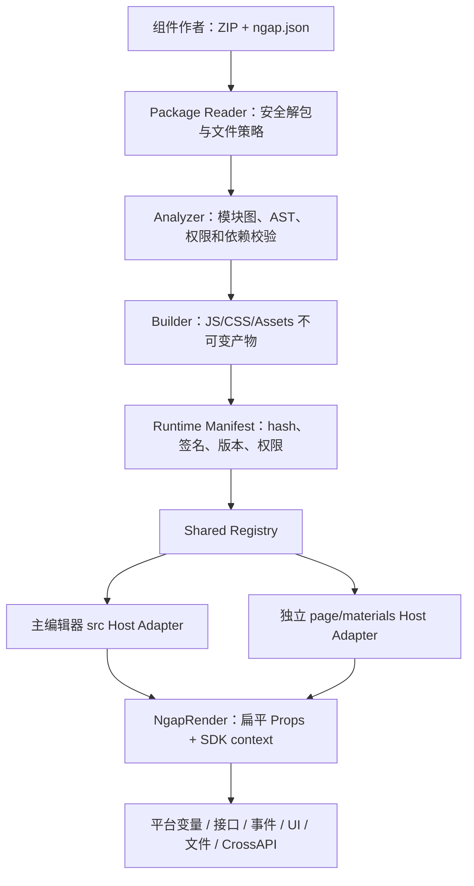

# 自定义元素 v2：React 组件 ZIP 包重写设计

## 1. 文档目的

本文用于指导 NGAP 自定义元素能力从“分别上传 TSX、Schema TS、Less 三份平台定制文件”升级为“上传一个完整的 React 组件 ZIP 包”。

目标不是只替换上传弹窗，而是重写自定义元素从源码进入平台到最终运行的完整链路：

- ZIP 组件包目录和清单协议；
- 组件入口和模块依赖图；
- 源码静态分析；
- 默认属性和属性面板生成；
- 事件与方法识别；
- 依赖解析与编译；
- 编辑器注册；
- 画布和预览渲染；
- 保存、审核、发布和版本管理；
- 主项目 `src` 与独立运行时 `page + materials` 的一致性；
- 旧三文件元素兼容；
- 生产安全边界。

本文给出目标架构和分阶段实施方案。第一阶段允许在现有后端字段上兼容落地，但最终生产方案推荐使用服务端构建、静态扫描、产物哈希和签名，浏览器不再在每次打开页面时编译原始 TSX。

---

## 2. 改造范围

### 2.1 本次包含

- 新建和编辑自定义元素；
- 单个 `.zip` 组件包上传；
- ZIP 内允许多个 TSX/TS/JSX/JS 模块、样式和静态资源；
- 入口模块默认导出 React 函数组件或 `forwardRef` 函数组件；
- 从 `ngap.json`、入口源码和类型声明生成平台配置；
- 属性、事件、方法、默认值和描述的统一 manifest；
- 依赖白名单；
- 编译、预览、注册、更新和卸载；
- 元素菜单；
- 属性面板、事件面板和方法调用；
- 应用编辑器和业务组件编辑器；
- 独立 `page` 运行页；
- 旧元素与旧页面数据兼容。

### 2.2 本次不直接包含

- 上传可直接执行安装脚本的任意 npm 工程；
- 把 `node_modules`、`.git`、构建缓存打进 ZIP；
- 自动安装用户指定的 npm 包；
- 允许 ZIP 内相对路径逃逸包根目录；
- 将任意第三方代码自动判定为安全；
- 自动理解所有 TypeScript 高级类型；
- 从任意业务实现中百分百准确推断事件和 ref 方法。

ZIP 是一个受约束的组件源码包，不是任意前端工程。它允许组件合理拆分文件和携带资源，但目录、入口、依赖、构建脚本和产物都必须受平台协议控制。

---

## 3. 术语

| 术语 | 含义 |
|---|---|
| v1 元素 | 当前 TSX + Schema TS/JS + Less 三文件元素 |
| v2 元素 | 新的 React 组件 ZIP 包元素 |
| 源包 | 用户上传的原始 ZIP 文件 |
| 包文件 | ZIP 内的 TSX/TS/JSX/JS、样式、资源和说明文件 |
| 入口模块 | `ngap.json.entry` 指定、默认导出 React 组件的模块 |
| manifest | 平台分析后得到的标准元素描述，不直接执行 |
| schema | 属性面板消费的 `attrs + config + events + methods` 兼容对象 |
| 构建产物 | 已转换、可动态导入的 ESM JavaScript |
| artifactKey | `elementId@version/hash`，唯一标识一次不可变构建 |
| 宿主 | 编辑器、预览弹窗或独立运行页 |
| registry | 统一自定义元素注册中心 |
| adapter | 把 NGAP 运行数据转换成 v2 组件 Props 的适配层 |

---

## 4. 现状分析

### 4.1 当前元素管理链路

主要文件：

```text
src/pages/elementManagement/index.tsx
src/pages/elementManagement/AddElementModal.tsx
src/pages/elementManagement/elementDetail.tsx
src/pages/elementManagement/onlineEditing.tsx
src/pages/elementManagement/previewElementModal.tsx
src/pages/elementManagement/SingleFunctionUploadModal.tsx
```

当前新增元素要求上传：

```text
组件逻辑：*.tsx
属性配置：*.ts 或 *.js
组件样式：*.less
```

上传接口：

```text
POST /csf/call/importOssByFileList
```

保存接口：

```text
POST /element/saveElementInfo
```

保存字段：

```ts
elementJsDemo: string;
elementConfigDemo: string;
elementCssDemo: string;
```

状态：

```text
1 草稿
2 已发布
3 待审核
4 审核驳回
5 已下线
6 原生元素
```

`SingleFunctionUploadModal.tsx` 已提供单 TSX 演示，但它与目标 ZIP 包方案不同，只能作为编译链路样例：

- Schema 为前端常量；
- 禁止所有 `import`；
- 只检查字符串中是否存在 `export default`；
- 只支持“编译并预览”；
- 不连接保存、审核、发布和编辑流程；
- 没有真正分析 Props、事件和方法。

项目已经依赖 `jszip`，`onlineEditing.tsx` 也存在 ZIP 解包代码，但当前实现只提取少量文本后缀、没有目录规范、没有 Zip Slip/Zip Bomb 防护、没有构建模块图，并且没有等待全部解包任务完成，不能直接作为正式 ZIP 包加载器。

### 4.2 当前主项目动态注册

核心文件：

```text
src/packages/index.tsx
```

主要流程：

```text
/element/queryElementList
        ↓
/csf/call/getElementFileInfo
        ↓
读取 tsxCode / jsCode / lessCode
        ↓
@babel/standalone 编译
        ↓
Blob URL + import()
        ↓
componentMap[elementId]
componentMap[elementId + "Config"]
```

当前实现的问题：

1. 自定义元素查询在模块加载时直接执行，属于不可控的全局副作用；
2. 三份文件必须分别编译和注册；
3. `fetchAllFileStream()` 使用固定 `setTimeout(100)` 等待 `File.text()`，存在竞态；
4. 动态组件的 Blob URL 没有统一回收；
5. Less style 重复插入时没有先清理旧样式；
6. 更新元素后没有同步清除 `componentCache`；
7. 编译失败只写控制台，调用方无法获得结构化错误；
8. `getComponent()` 通过 `typeof value === 'function'` 判断是否为工厂函数，可能把普通函数组件直接调用，造成 Hook 调用错误；
9. 注册表只存裸值，无法表达加载中、失败、版本、来源和清理函数；
10. 依赖通过 `window.React`、`window.antd` 或全局工具隐式注入，没有协议和版本检查。

### 4.3 当前预览链路

核心文件：

```text
src/pages/elementManagement/previewElementModal.tsx
```

当前预览会：

- 单独编译 Schema；
- 单独编译 TSX；
- 写入 `window.MyComponentJsData`；
- 写入 `window.MyComponent`；
- 直接 `ReactDOM.createRoot()` 渲染一次；
- 同时打开 `CanvasEditingComponent`，通过特殊 `typeZDY = 'ZDY'` 再走一次平台画布链路。

问题：

- 预览状态污染全局 window；
- 多个预览会互相覆盖；
- 关闭和再次打开存在旧组件残留风险；
- 正式自定义元素和临时预览元素走不同代码路径；
- `customComponent` 是特殊占位类型，不能代表真实 elementId；
- 直接渲染和画布渲染可能出现行为不一致；
- 属性面板通过全局对象读取 Schema。

### 4.4 当前编辑器消费方式

元素拖入画布时，主要通过：

```ts
const {
    config,
    events,
    methods,
    elements,
} = (await getComponent(type + 'Config'))?.default || {};
```

随后写入页面数据：

```ts
{
    id,
    type,
    name,
    config,
    events,
    methods,
    elements,
}
```

属性面板由：

```text
src/layout/components/ConfigPanel/ConfigPanel.tsx
```

读取 `attrs` 和 `config`。

事件面板区分：

- `element.events`：组件声明的可配置事件；
- `element.config.events`：设计者配置的事件流实例。

方法调用面板读取：

- `element.methods`：组件对外暴露的方法定义；
- 运行时通过 ref 注册表调用实际方法。

因此 v2 不能只生成默认 Props，还必须生成与现有编辑器兼容的：

```ts
{
    attrs,
    config,
    events,
    methods,
    elements,
}
```

### 4.5 当前统一渲染

主项目：

```text
src/packages/NgapRender/NgapRender.tsx
```

当前 Material 传给组件的 Props 近似：

```tsx
<Component
    id={item.id}
    type={item.type}
    config={config}
    elements={item.elements || []}
    loopVariable={loopVariable}
    {...eventHandlers}
    ref={registerRef}
/>
```

这是平台内部物料协议，不是普通 React 组件常见写法。用户期望上传的组件通常更接近：

```tsx
function CustomerCard({ title, disabled, onConfirm, context }) {}
```

新运行时必须增加 Props adapter，在不破坏 v1 的情况下，为 v2 提供扁平 Props。

### 4.6 独立运行时

生产构建还包含：

```text
page/src/page/index.tsx
materials/index.tsx
materials/NgapRender/NgapRender.tsx
```

`page` 会根据应用返回的 `elementIds` 查询自定义元素，再由 `materials/index.tsx` 重新下载和编译三份源码。

主项目与独立运行时存在两套相似但不一致的实现，例如：

- 主项目 `componentMap[elementId + 'Config']` 保存配置；
- `materials/index.tsx` 的旧实现曾把配置模块写入 `componentMap[elementId]`；
- 两边对“函数是组件还是工厂”的判断不同；
- 两边 Babel 加载和缓存策略不同；
- 修复一边不会自动修复另一边。

正式重写必须抽取共享协议、manifest 规范、registry 和 adapter。宿主可以有不同的请求适配器，但核心行为不能再复制。

### 4.7 已取得的真实样例

接口样例中的 TSX：

```tsx
import React from 'React';

export default function Demo({ title, context: { id } }) {
    return (
        <div data-id={id} className="manual-demo-title">
            {title}
        </div>
    );
}
```

Schema：

```ts
export default {
    attrs: [
        { type: 'Title', label: '基础配置', name: 'base' },
        { type: 'Input', label: '标题', name: 'title' },
    ],
    config: {
        props: { title: 'hello' },
        style: {},
        api: {},
    },
    events: [],
    methods: [],
};
```

这说明实际开发者已经倾向使用扁平 `title` 和 `context`，而当前 `NgapRender` 仍只把业务属性放在 `config.props` 中。v2 应正式统一为扁平 Props，同时保留 `config` 兼容入口。

---

## 5. 重写目标

### 5.1 用户体验目标

用户只上传一个组件包：

```text
customer-info-card.zip
```

平台自动完成：

1. 安全解包并识别包根目录；
2. 读取或生成 `ngap.json`；
3. 从 entry 建立模块、样式和资源依赖图；
4. 解析默认导出并判断是否为 React 函数组件；
5. 分析 Props、默认值、事件和方法；
6. 校验外部依赖、SDK 版本和权限；
7. 生成属性面板和标准 manifest；
8. 服务端打包并预览；
9. 保存草稿或提交审核；
10. 发布后注册到元素菜单；
11. 在编辑器和独立运行页一致渲染。

### 5.2 技术目标

- v2 协议不依赖 `window.MyComponent`；
- v2 不要求用户理解 NGAP 的旧 Schema 文件格式；
- v2 不在每个页面入口复制编译器；
- v2 不通过 `typeof function` 猜测组件类型；
- 所有异步加载都有明确 Promise、状态和错误；
- 一个构建产物只注册一次；
- 更新后旧缓存和旧样式可清理；
- 页面可以锁定元素版本；
- v1 和 v2 可以同时存在。

### 5.3 非目标

- 不承诺零配置推断所有复杂组件；
- 不允许任意 npm 依赖；
- 不把 AST 检查宣传成真正安全沙箱；
- 不要求第一阶段立刻删除 v1。

---

## 6. 关键设计结论

1. 上传物是一个受约束的组件 ZIP 包，而不是一个孤立 TSX，也不是包含 `node_modules` 的任意工程。
2. ZIP 通过根目录 `ngap.json` 声明入口、组件元数据、依赖和平台能力；缺失时只允许生成草稿，发布前必须补齐。
3. 包内允许相对路径模块、Less/CSS 和静态资源，由平台构建器统一解析、打包和指纹化。
4. 普通 Props、字面量默认值和 `onXxx` 回调可以从入口模块及本地类型文件自动推导。
5. 复杂属性编辑器、中文文案、方法参数、容器能力和所需平台 SDK 权限由 `ngap.json` 补充。
6. manifest 必须可静态读取，分析阶段不得为了读取配置而执行用户源码。
7. v2 组件接收扁平 Props 和版本化平台 SDK context，同时由 adapter 提供旧 `config` 兼容值。
8. 组件不能直接依赖项目 Store、内部工具文件或环境地址，变量、接口、事件、上传、消息等能力由平台 SDK 显式暴露。
9. 正式 ZIP 包必须由服务端构建和签名；浏览器只负责解包预检，简单本地预览可以使用受限开发构建器。
10. 编辑器和独立运行页必须共用 package contract、manifest、SDK、registry 和 Props adapter。
11. v1/v2 由显式 `protocolVersion` 区分，不通过文件名或源码内容永久猜测。
12. 元素版本发布后构建产物不可变，应用实例应逐步支持版本锁定。
13. 任意 JavaScript 在主窗口执行都等同于获得页面权限；静态扫描只能降低风险，不能形成安全隔离。

### 6.1 为什么推荐“受约束 ZIP + 平台 SDK”

| 方案 | 多文件/资源 | 开发体验 | 平台治理 | 运行一致性 | 结论 |
|---|---:|---:|---:|---:|---|
| 单 TSX 文本 | 弱 | 简单组件尚可 | 较容易 | 多 import/样式后迅速失效 | 只适合演示，不作为正式协议 |
| 旧 TSX + Schema + Less 三文件 | 弱 | 强平台定制、学习成本高 | 可控但耦合旧实现 | 当前已有三套编译漂移 | 只保留 v1 兼容 |
| 任意 npm 工程 ZIP | 强 | 看似自由 | scripts/node_modules/依赖风险极高 | 构建不可复现 | 不接受 |
| 受约束组件 ZIP + `ngap.json` | 强 | 接近正常 React 组件 | 清单、权限、白名单、构建器均可治理 | 可生成统一不可变产物 | v2 推荐方案 |
| 远程 iframe/微应用 | 最强隔离 | 运维和通信成本高 | 安全边界最好 | 与低代码 Props/事件集成更复杂 | 未来高风险第三方组件模式 |

推荐方案的关键不是 ZIP 后缀，而是同时具备四个边界：

1. **包边界**：允许合理拆文件，但禁止任意工程结构、脚本和 node_modules；
2. **元数据边界**：`ngap.json` 与静态 AST 可读，不能执行源码取配置；
3. **能力边界**：项目能力只通过版本化、按权限裁剪的 SDK 暴露；
4. **产物边界**：生产只执行服务端构建、扫描、签名的不可变产物。

### 6.2 目标分层



Package Reader、Analyzer、contract、manifest validator、registry facade、Props adapter 和 SDK types 必须共享；只有连接各自 Store、路由、消息和 CrossAPI 的 Host Adapter 可以不同。

---

## 7. ZIP 组件包协议

### 7.1 标准目录结构

推荐模板：

```text
customer-info-card.zip
├─ ngap.json                 # 必需：组件包清单
├─ package.json              # 可选：只用于声明白名单依赖
├─ README.md                 # 可选：使用说明
├─ src/
│  ├─ index.tsx              # 必需：入口模块，默认导出 React 组件
│  ├─ types.ts               # 可选：本地类型
│  ├─ hooks/
│  │  └─ useCustomer.ts      # 可选：包内模块
│  └─ styles/
│     └─ index.less          # 可选：样式
└─ assets/
   ├─ empty.svg              # 可选：静态资源
   └─ default.png
```

平台同时接受 ZIP 外面多包一层同名目录：

```text
customer-info-card.zip
└─ customer-info-card/
   ├─ ngap.json
   └─ src/index.tsx
```

解包后若根目录只有一个普通目录，平台可以自动提升一层；超过一层或存在多个候选 `ngap.json` 时必须报错，不允许猜入口。

ZIP 内禁止：

```text
node_modules/
.git/
dist/
coverage/
.env*
*.pem
*.key
系统绝对路径
符号链接
```

### 7.2 最小包

最小 `ngap.json`：

```json
{
  "protocolVersion": 2,
  "name": "customer-info-card",
  "version": "1.0.0",
  "entry": "src/index.tsx",
  "component": {
    "title": "客户信息卡片",
    "description": "展示客户摘要并触发确认事件"
  },
  "sdk": {
    "version": "^2.0.0",
    "permissions": []
  }
}
```

入口 `src/index.tsx`：

```tsx
import React from 'react';

interface CustomerCardProps {
    title?: string;
    count?: number;
    disabled?: boolean;
    onConfirm?: (payload: { count: number }) => void;
}

export default function CustomerCard({
    title = '客户信息',
    count = 0,
    disabled = false,
    onConfirm,
}: CustomerCardProps) {
    return (
        <section>
            <h3>{title}</h3>
            <button
                disabled={disabled}
                onClick={() => onConfirm?.({ count })}
            >
                确认
            </button>
        </section>
    );
}
```

平台可以自动得到：

```text
组件名：CustomerCard
属性：title / count / disabled
默认值：客户信息 / 0 / false
事件：onConfirm
```

自动生成的属性控件：

```text
title    → Input
count    → InputNumber
disabled → Switch
```

### 7.3 完整包

完整包通过 `ngap.json` 补充平台元数据，源码只负责组件实现。

`ngap.json`：

```json
{
  "protocolVersion": 2,
  "name": "customer-info-card",
  "version": "1.0.0",
  "entry": "src/index.tsx",
  "styles": ["src/styles/index.less"],
  "component": {
    "title": "客户信息卡片",
    "description": "展示客户摘要并触发确认事件"
  },
  "groups": [
    { "key": "basic", "title": "基础配置" },
    { "key": "appearance", "title": "外观配置" },
    { "key": "state", "title": "状态配置" }
  ],
  "props": {
    "title": {
      "label": "标题",
      "editor": "Input",
      "defaultValue": "客户信息",
      "group": "basic"
    },
    "description": {
      "label": "说明",
      "editor": "TextArea",
      "defaultValue": "",
      "group": "basic"
    },
    "variant": {
      "label": "展示类型",
      "editor": "Select",
      "defaultValue": "default",
      "group": "appearance",
      "options": [
        { "label": "默认", "value": "default" },
        { "label": "警告", "value": "warning" },
        { "label": "成功", "value": "success" }
      ]
    },
    "disabled": {
      "label": "是否禁用",
      "editor": "Switch",
      "defaultValue": false,
      "group": "state"
    }
  },
  "events": [
    { "name": "onConfirm", "title": "确认事件" }
  ],
  "methods": [
    { "name": "focus", "title": "聚焦", "params": [] },
    {
      "name": "reset",
      "title": "重置",
      "params": [
        {
          "name": "reason",
          "title": "重置原因",
          "type": "input",
          "required": false
        }
      ]
    }
  ],
  "capabilities": {
    "container": false,
    "dataSource": false,
    "apiMode": "none"
  },
  "sdk": {
    "version": "^2.0.0",
    "permissions": [
      "events.emit",
      "logger.write"
    ]
  }
}
```

`src/index.tsx`：

```tsx
import React, { forwardRef, useImperativeHandle, useRef } from 'react';
import { Button, Card } from 'antd';

interface CustomerCardProps {
    title?: string;
    description?: string;
    variant?: 'default' | 'warning' | 'success';
    disabled?: boolean;
    onConfirm?: (payload: { source: string }) => void;
}

export interface CustomerCardRef {
    focus(): void;
    reset(reason?: string): void;
}

const CustomerInfoCard = forwardRef<CustomerCardRef, CustomerCardProps>(
    function CustomerInfoCard(
        {
            title = '客户信息',
            description = '',
            variant = 'default',
            disabled = false,
            onConfirm,
        },
        ref,
    ) {
        const buttonRef = useRef<HTMLButtonElement>(null);

        useImperativeHandle(ref, () => ({
            focus: () => buttonRef.current?.focus(),
            reset: (reason?: string) => console.log('reset', reason),
        }));

        return (
            <Card title={title} data-variant={variant}>
                <p className="customer-info-card__description">
                    {description}
                </p>
                <Button
                    ref={buttonRef}
                    disabled={disabled}
                    onClick={() => onConfirm?.({ source: 'button' })}
                >
                    确认
                </Button>
            </Card>
        );
    },
);

export default CustomerInfoCard;
```

### 7.4 入口默认导出规则

允许：

```tsx
export default function Demo() {}
```

```tsx
const Demo = () => <div />;
export default Demo;
```

```tsx
const Demo = React.forwardRef((props, ref) => <div />);
export default Demo;
```

```tsx
export default React.memo(Demo);
```

```tsx
export default React.memo(React.forwardRef(Demo));
```

不允许：

```tsx
export { Demo };
```

```tsx
export default new Demo();
```

```tsx
export default await loadComponent();
```

分析器必须输出明确诊断：

```text
CE1001：未找到默认导出。
CE1002：默认导出无法静态确认是 React 组件。
CE1003：默认导出依赖异步运行结果，不支持。
```

### 7.5 `ngap.json` 规则

`ngap.json` 是 ZIP 包的源清单，必须是标准 JSON，不能包含注释、函数或表达式。

```json
{
  "protocolVersion": 2,
  "name": "customer-info-card",
  "version": "1.0.0",
  "entry": "src/index.tsx"
}
```

必需字段：

- `protocolVersion`：固定为 2；
- `name`：小写英文、数字和短横线，包内稳定标识；
- `version`：语义化版本；
- `entry`：包根目录内的入口模块；
- `component.title`：元素默认中文名称；
- `sdk.version`：组件兼容的 SDK semver range；
- `sdk.permissions`：权限数组，无权限时写空数组。

可选字段：

- `styles`：包内 CSS/Less 文件数组；
- `component.description/categoryHint/tags`：描述和分类提示；
- `props/groups/events/methods`：平台配置；
- `capabilities`：容器、数据源和表单项能力；
- `dependencies`：允许的宿主依赖；
- `assets`：需要复制或内联的静态资源规则；
- `compatibility`：浏览器和平台版本范围。

路径规则：

- 使用 `/` 作为分隔符；
- 不能是绝对路径；
- 规范化后不能包含 `..`；
- 不能指向包外；
- 路径大小写必须与 ZIP 条目一致；
- entry 必须是 `.tsx/.ts/.jsx/.js`；
- style 必须是 `.css/.less`。

平台可以为缺少 `ngap.json` 的 ZIP 生成草稿清单，但这种包只能预览和保存草稿，不能提交审核或发布。

### 7.6 `ngap.json` 完整字段模型

```ts
export interface NgapPackageManifestV2 {
    /** 固定为 2 */
    protocolVersion: 2;

    /** 包标识，不等同于后端 elementId */
    name: string;

    /** 包源码版本，使用 semver */
    version: string;

    /** 默认导出 React 组件的包内入口 */
    entry: string;

    /** 可由入口 import，也可在这里显式声明 */
    styles?: string[];

    component: {
        title: string;
        description?: string;
        categoryHint?: string;
        tags?: string[];
    };

    groups?: Array<{
        key: string;
        title: string;
        order?: number;
    }>;

    props?: Record<string, {
        label?: string;
        description?: string;
        editor?: string;
        defaultValue?: unknown;
        required?: boolean;
        group?: string;
        order?: number;
        options?: Array<{
            label: string;
            value: string | number;
        }>;
        editorProps?: Record<string, unknown>;
        hidden?: boolean;
    }>;

    events?: Array<{
        name: string;
        title: string;
        description?: string;
        payloadSchema?: Record<string, unknown>;
    }>;

    methods?: Array<{
        name: string;
        title: string;
        description?: string;
        params?: Array<{
            name: string;
            title: string;
            type: 'input' | 'select';
            required?: boolean;
            options?: Array<{
                label: string;
                value: string | number;
            }>;
        }>;
    }>;

    capabilities?: {
        container?: boolean;
        accepts?: string[];
        dataSource?: boolean;
        formItem?: boolean;
        apiMode?: 'none' | 'configured' | 'declared' | 'both';
    };

    sdk: {
        version: string;
        permissions: string[];
    };

    /** 宿主外部依赖，版本必须落入平台白名单 */
    dependencies?: Record<string, string>;

    assets?: {
        include?: string[];
        inlineLimit?: number;
    };

    compatibility?: {
        platform?: string;
        browsers?: string[];
    };

    security?: {
        policy?: 'trusted-main-window' | 'sandbox-iframe';
    };
}
```

字段校验：

| 字段 | 规则 |
|---|---|
| `name` | `^[a-z][a-z0-9-]{1,63}$` |
| `version` | 合法 semver，不允许发布版本复用 |
| `entry` | 包内相对路径，扩展名为 TSX/TS/JSX/JS |
| `styles` | 包内 CSS/Less 文件，去重后有序 |
| `component.title` | 必填，建议 2～30 个字符 |
| `props` key | 合法 JS 标识符，不能与保留 Props 冲突 |
| `events[].name` | 建议 `onXxx`，必须唯一 |
| `methods[].name` | 合法 JS 标识符，必须唯一 |
| `sdk.version` | semver range，构建时与宿主 SDK 匹配 |
| `sdk.permissions` | 必须来自平台权限字典，自动去重排序 |
| `dependencies` | 只能声明平台白名单包和允许范围 |

如果 `package.json` 和 `ngap.json.dependencies` 同时存在，两边必须一致；不一致时阻止构建，不能任意选择一边。

`ngap.json.version` 是组件作者提交的源码包版本，后端 `elementVersion` 是平台发布版本。推荐二者使用同一 semver，但最终以平台版本服务为准：

- 新建元素时可使用包版本作为初始建议值；
- 同一 elementId 下版本必须单调且不能复用已发布版本；
- 包版本低于或等于当前发布版本时，上传页要求选择新的发布版本；
- artifactHash 不作为人类可见版本，但必须与发布版本一一绑定；
- 不使用 `V2.0` 同时表示“协议 v2”和“元素第 2 版”，协议始终由 `protocolVersion: 2` 单独表达。

### 7.7 元数据优先级

字段来源优先级从高到低：

1. 上传页面中用户最终确认的值；
2. `ngap.json`；
3. 入口模块和包内 TypeScript 类型、JSDoc 推导；
4. 入口函数名、ZIP 文件名和系统默认值。

例如：

- 函数名为 `CustomerCard`；
- `ngap.json` 中 `component.title = '客户信息卡片'`；
- 上传表单中用户改成“客户概览卡”；

最终元素名称使用“客户概览卡”。源码中的标题只用于预填，不强制覆盖平台表单。

### 7.8 包内模块和资源规则

允许相对路径 import：

```tsx
import type { Customer } from './types';
import { useCustomer } from './hooks/useCustomer';
import './styles/index.less';
import emptyImage from '../assets/empty.svg';
```

构建器必须：

- 从 `entry` 建立完整模块图；
- 只解析 ZIP 内部相对路径；
- 支持扩展名补全和 `index.*`；
- 检测循环依赖并给出诊断；
- 处理 CSS/Less 和资源 import；
- 对资源重命名加 hash；
- 重写最终资源 URL；
- tree-shake 未使用模块；
- 拒绝路径逃逸和符号链接。

ZIP 内的 `package.json` 只读取 `name/version/dependencies/peerDependencies`。禁止执行：

```text
scripts
postinstall
preinstall
prepare
bin
workspaces
```

禁止打包 `node_modules`。第三方包必须由宿主白名单提供，或者由服务端构建器按平台锁定版本解析。

建议文件策略：

| 类别 | 允许后缀/文件 | 是否进入模块图 | 处理方式 |
|---|---|---:|---|
| 源码 | `.ts/.tsx/.js/.jsx` | 是 | AST 分析并由 bundler 构建 |
| 类型 | `.d.ts` | 类型图 | 仅类型检查，不进入运行产物 |
| 数据 | `.json` | 被 import 时 | 校验 JSON，限制单文件大小 |
| 样式 | `.css/.less` | 被 import/manifest 引用时 | 编译、前缀隔离、提取 CSS |
| 图片 | `.png/.jpg/.jpeg/.gif/.webp/.svg` | 被引用时 | MIME 校验、hash 重命名；SVG 额外扫描 |
| 字体 | 首期默认禁止 | 否 | 后续按字体许可和体积策略开放 |
| 文档 | `README.md`、`CHANGELOG.md` | 否 | 只用于审核展示，不发布到运行 CDN |
| 清单 | `ngap.json`、`package.json` | 否 | 严格 schema 校验 |
| Source map | `.map` | 否 | 上传包默认忽略/警告，服务端重新生成 |
| 其他 | 二进制、可执行文件、压缩包 | 否 | 拒绝 |

资源处理还必须包含：

- 校验文件 magic bytes 与扩展名/MIME 一致；
- SVG 禁止脚本、外部资源、事件属性和危险 URL；
- 图片解码后检查真实像素，防止极端尺寸导致内存问题；
- CSS 中的 `url()` 只能引用包内资源，禁止 `file:`、`javascript:` 和任意内网 URL；
- 未被入口模块图或 `ngap.json.assets` 引用的资源给出警告，不进入运行产物；
- 所有文本统一按 UTF-8 解码，BOM 可移除，非法编码阻止发布。

包根目录归一化算法必须确定：

1. 忽略系统生成的 `__MACOSX/` 和根目录 `.DS_Store`，并给出 warning；
2. 如果根目录直接有 `ngap.json`，它就是包根；
3. 否则只有在 ZIP 恰好只有一个普通顶层目录，且该目录内有 `ngap.json` 时自动上移一层；
4. 多个候选 `ngap.json`、多层模糊嵌套或仅凭 `package.json` 猜入口时阻止发布；
5. 规范化后重新执行所有路径、大小、冲突和敏感文件校验。

### 7.9 ZIP 安全与容量限制

上传端和服务端都必须校验：

```text
ZIP 原始大小：建议不超过 10 MB
解压后总大小：建议不超过 30 MB
文件数量：建议不超过 300
单文件：建议不超过 2 MB
目录深度：建议不超过 12
压缩比：异常高时按 Zip Bomb 拒绝
```

必须防止：

- Zip Slip（`../`、绝对路径、盘符路径）；
- 同名路径覆盖；
- Unicode 归一化后重名；
- 大小写不敏感系统上的路径冲突；
- CRC 错误；
- 加密 ZIP；
- 多重嵌套压缩包；
- 符号链接和特殊设备文件；
- 伪装扩展名。

### 7.10 保留 Props

以下名称由平台保留，不生成普通属性编辑项：

```text
key
ref
children
context
config
id
type
elements
loopVariable
className
style
```

其中：

- `context` 是 v2 平台上下文；
- `config/id/type/elements/loopVariable` 是兼容 Props；
- `className/style` 由平台样式配置控制；
- `children` 只有声明容器能力时才由平台提供。

用户在 `ngap.json.props` 中配置保留名称时，分析器报错而不是静默忽略。

---

## 8. v2 组件运行协议

### 8.1 组件最终接收的 Props

```ts
export interface NgapFunctionComponentProps<P extends object = object> {
    /** 用户业务属性，运行时直接展开 */
    // ...P

    /** 平台生成的 className */
    className?: string;

    /** 平台合并后的样式 */
    style?: React.CSSProperties;

    /** 稳定平台上下文 */
    context: NgapComponentContext;

    /** v1 兼容，不推荐新组件直接依赖 */
    config: ConfigType<P>;

    /** v1 兼容 */
    id: string;
    type: string;
    elements?: ComponentType[];
    loopVariable?: unknown;
}
```

实际 adapter：

```tsx
const runtimeProps = {
    ...config.props,
    ...eventHandlers,
    className: 'Ngap-component',
    style: config.style,
    context,

    // 兼容字段
    id: item.id,
    type: item.type,
    config,
    elements: item.elements || [],
    loopVariable,
};

return <Component {...runtimeProps} ref={componentRef} />;
```

属性覆盖顺序必须固定：

1. 用户业务 Props；
2. 平台事件回调；
3. 平台保留 Props。

用户不能通过配置覆盖 `context`、`id` 或平台生成的事件函数。

### 8.2 平台 SDK context

自定义组件使用的 API 必须由 NGAP 项目显式暴露。组件不能直接 import：

```text
src/stores/**
src/utils/request
src/packages/utils/**
materials/stores/**
任何内部页面模块
```

原因：这些模块不是稳定公共协议，会泄漏 Store、Token、环境地址和内部实现；项目重构也会直接破坏已发布组件。

平台以 `context` 注入版本化 SDK：

```ts
export interface NgapComponentContext {
    protocolVersion: 2;
    sdkVersion: string;
    mode: 'editor' | 'preview' | 'runtime';

    element: {
        id: string;
        type: string;
        name: string;
        version?: string;
        artifactHash?: string;
    };

    instance: {
        /** 当前画布元素实例 ID；同一元素定义可以有多个实例 */
        id: string;
        pageId?: string;
        componentId?: string;
        appId?: string;
        tenantId?: string;
        locale: string;
    };

    variables: {
        get(name: string): unknown;
        set(name: string, value: unknown): Promise<void>;
        subscribe(name: string, listener: (value: unknown) => void): () => void;
        renderFormula(expression: string, eventParams?: unknown): unknown;
    };

    api: {
        call<TInput = unknown, TOutput = unknown>(input: {
            /** 使用平台登记的接口 ID，不允许传任意生产 URL */
            interfaceId: string;
            params?: TInput;
            signal?: AbortSignal;
            silent?: boolean;
        }): Promise<TOutput>;

        executeConfigured<TOutput = unknown>(input?: {
            eventParams?: unknown;
            overrides?: Record<string, unknown>;
        }): Promise<TOutput>;
    };

    integrations: {
        /**
         * 调用平台登记的 CrossAPI/坐席/宿主集成能力。
         * capability 不是原始 CrossAPI 方法名，而是平台治理后的能力编码。
         */
        call<TInput = unknown, TOutput = unknown>(input: {
            capability: string;
            params?: TInput;
            signal?: AbortSignal;
        }): Promise<TOutput>;
        subscribe<TPayload = unknown>(input: {
            event: string;
            listener: (payload: TPayload) => void;
        }): () => void;
    };

    events: {
        emit(name: string, payload?: unknown): void;
    };

    ui: {
        message: {
            success(content: string): void;
            error(content: string): void;
            warning(content: string): void;
            info(content: string): void;
        };
        confirm(options: {
            title: string;
            content?: string;
            okText?: string;
            cancelText?: string;
        }): Promise<boolean>;
        notification(options: {
            type: 'success' | 'error' | 'warning' | 'info';
            title: string;
            description?: string;
        }): void;
    };

    files: {
        upload(options: {
            file: File;
            policy: 'image' | 'attachment';
            onProgress?: (percent: number) => void;
        }): Promise<{ url: string; name: string; size: number }>;
        download(options: { url: string; fileName?: string }): Promise<void>;
    };

    navigation: {
        open(options: {
            type: 'route' | 'link' | 'micro';
            target: string;
            newWindow?: boolean;
            params?: Record<string, unknown>;
        }): Promise<void>;
    };

    user: {
        getBasicInfo(): Promise<{
            provinceId?: string;
            serviceTypeId?: string;
        }>;
    };

    storage: {
        get<T = unknown>(key: string): Promise<T | undefined>;
        set<T = unknown>(key: string, value: T): Promise<void>;
        remove(key: string): Promise<void>;
    };

    children?: {
        elements: ComponentType[];
        render(): React.ReactNode;
    };

    logger: {
        debug(message: string, data?: unknown): void;
        warn(message: string, data?: unknown): void;
        error(message: string, error?: unknown): void;
    };
}
```

SDK 的关键约束：

- context 字段保持稳定，不能暴露 Zustand Store；
- 不继续把 `useAppContext`、`handleApi`、`request` 当作 v2 公共协议；
- `api.call()` 使用平台登记的 interfaceId，由平台处理环境地址、鉴权、租户、超时、错误码和审计；
- `integrations.call()` 只能使用平台治理后的能力编码，不能把原始 `CrossAPI` 对象交给组件；
- 不向组件暴露 Token、Cookie、Axios 实例或任意内网 baseURL；
- `storage` 使用 elementId + instanceId 命名空间，不能读取其他组件数据；
- editor/preview/runtime 提供同一接口，预览环境可以返回 mock 或权限错误；
- SDK 方法统一返回 Promise 或明确的同步结果；
- context 使用 `useMemo`，subscribe 必须返回清理函数；
- 每个 SDK 调用记录 elementId、版本、调用能力和结果状态。

### 8.3 SDK 权限声明

组件包在 `ngap.json` 中声明最小权限：

```json
{
  "sdk": {
    "version": "^2.0.0",
    "permissions": [
      "variables.read",
      "events.emit",
      "api.call:customer.query",
      "ui.message",
      "files.upload:image"
    ]
  }
}
```

建议权限项：

```text
variables.read
variables.write
events.emit
api.call:<接口能力编码>
api.configured
integration.call:<宿主能力编码>
integration.subscribe:<宿主事件编码>
ui.message
ui.confirm
ui.notification
files.upload:image
files.upload:attachment
files.download
navigation.route
navigation.link
user.read.basic
storage.component
children.render
logger.write
```

权限处理：

1. 解包时校验权限名称；
2. 分析页展示组件申请的能力；
3. 审核人确认高风险权限；
4. 发布产物固化权限集合；
5. 运行时根据权限生成 capability-scoped context；
6. 未声明权限的方法不存在或调用时返回 `SDK_PERMISSION_DENIED`；
7. 元素升级新增权限时，必须重新审核，不能静默扩大权限。

平台需要维护可查询的能力目录，而不是让开发者猜 `interfaceId`：

```ts
interface NgapSdkCapabilityDefinition {
    code: string;                 // customer.query / agent.call-out
    namespace: 'api' | 'integration' | 'ui' | 'files' | 'navigation';
    title: string;
    description?: string;
    sdkSince: string;
    deprecatedSince?: string;
    risk: 'low' | 'medium' | 'high';
    modes: Array<'editor' | 'preview' | 'runtime'>;
    inputSchema?: Record<string, unknown>;
    outputSchema?: Record<string, unknown>;
    rateLimit?: { count: number; windowSeconds: number };
    requiresReview: boolean;
}
```

能力目录由项目/后端发布，开发包和上传页只消费它：

```text
GET /element/queryComponentSdkCapabilities?sdkVersion=2.0.0
```

上传分析器对字面量调用进行交叉校验：

```tsx
context.api.call({ interfaceId: 'customer.query', ... })
```

必须在 `ngap.json` 里声明 `api.call:customer.query`。动态拼接 `interfaceId/capability/event` 默认阻止发布，因为平台无法静态确认最小权限。确需动态选择时，只能从 manifest 显式列出的有限枚举中选择。

上传页面应把权限按风险分组展示，并给出“源码使用位置、用途说明、数据范围、运行模式”。高风险接口、文件下载、外链跳转、CrossAPI 写操作需要单独审批。

### 8.4 SDK 版本管理

```json
{
  "sdk": {
    "version": "^2.0.0"
  }
}
```

平台构建时校验版本范围：

- 当前宿主 SDK 满足范围：允许构建；
- 只存在可兼容弃用项：警告；
- 不满足：阻止发布；
- 已发布组件运行时仍使用其声明兼容的 SDK adapter；
- SDK 删除能力必须经过弃用周期，不能直接移除。

为开发者提供只含类型和本地 mock 的 SDK 包：

```tsx
import type {
    NgapComponentProps,
    NgapComponentContext,
} from '@ngap/component-sdk';
```

`@ngap/component-sdk` 的运行时实现不打入 ZIP；实际对象由宿主注入。

### 8.5 SDK 与现有项目能力的对应关系

SDK 不是另起一套业务实现，而是在现有能力外面增加稳定、可审计的适配层。首期映射建议如下：

| 组件需要的能力 | v2 公共接口 | 当前项目实现来源 | 适配原则 |
|---|---|---|---|
| 读取页面变量 | `context.variables.get()` | `getPageVariable()`、page store | 只返回当前页面允许访问的变量快照 |
| 写入页面变量 | `context.variables.set()` | page store 的变量更新动作 | 校验变量是否存在、是否可写并触发订阅更新 |
| 公式计算 | `context.variables.renderFormula()` | `renderFormula()` | 包装异常，禁止把内部 Store 作为第三方参数泄漏 |
| 调用元素已配置接口 | `context.api.executeConfigured()` | `handleApi(config.api, ...)` | 复用属性面板中的接口配置和参数映射 |
| 调用平台登记接口 | `context.api.call()` | 项目 `request` + 接口能力配置 | 组件只传 `interfaceId`，宿主补环境、鉴权和租户 |
| 触发组件事件 | 回调 Props / `context.events.emit()` | `NgapRender` + `handleActionFlow()` | 事件名必须出现在 manifest，动作编排仍由平台执行 |
| 消息与确认框 | `context.ui.*` | antd `message/Modal/notification` | 避免组件自己创建全局 UI 实例，统一主题和销毁 |
| 文件上传下载 | `context.files.*` | `request.upload()`、OSS 上传接口 | 平台选择接口、校验类型大小并隐藏真实存储凭证 |
| 页面跳转 | `context.navigation.open()` | 路由、微应用、外链能力 | 区分 route/link/micro 权限，过滤危险 URL scheme |
| 基础用户上下文 | `context.user.getBasicInfo()` | `crossApiUserInfo` 等 Store | 只给允许字段，不暴露完整坐席/客户敏感数据 |
| CrossAPI/宿主能力 | `context.integrations.*` | `CrossAPI`、`crossAPIUtil` | 能力编码白名单，不暴露 `getContact/on/trigger` 原对象 |
| 组件实例存储 | `context.storage.*` | 平台存储 adapter | 按 tenant/app/page/element/instance 做命名空间隔离 |
| 子元素渲染 | `context.children.render()` | `NgapRender` 递归渲染 | 只对审核通过的容器元素开放 |
| 日志 | `context.logger.*` | 项目日志与监控 | 自动带 element/version/instance，生产过滤敏感字段 |

明确禁止把下面这些对象塞进 `context`：

```text
usePageStore / useAppContext / Zustand store
request / axios instance / fetch wrapper
CrossAPI 原始实例
Token / Cookie / OSS credential / 内网 baseURL
handleActionFlow / action 节点执行器
完整 userInfo / 客户资料 Store
```

原因不是“组件暂时用不到”，而是这些都属于项目私有实现。一旦成为公共 API，项目后续几乎无法重构，也无法做细粒度权限控制。

主编辑器和独立运行页各自实现 host adapter，但必须通过同一套契约测试：

```ts
interface NgapSdkHostAdapter {
    createContext(input: {
        manifest: CustomElementManifestV2;
        element: ComponentType;
        config: ElementConfig;
        mode: 'editor' | 'preview' | 'runtime';
        loopVariable?: unknown;
    }): NgapComponentContext;

    dispose(instanceId: string): void;
}
```

`src` adapter 可以连接编辑器 Store，`materials/page` adapter 可以连接独立运行页 Store；对组件而言两边的类型、权限判断、错误码和调用结果必须相同。

### 8.6 SDK 调用语义

所有有副作用的 SDK 方法都采用 Promise，并遵守同一行为：

1. 先检查组件发布状态、artifactHash、SDK 版本和权限；
2. 再检查输入结构、字段长度、数据体积和能力范围；
3. 由宿主补齐 appId、pageId、tenantId、用户上下文和环境地址；
4. 执行超时、取消、限流和重试策略；
5. 将后端或 CrossAPI 的差异错误归一化；
6. 写审计日志，但不记录 Token、Cookie、文件内容或敏感业务字段；
7. 返回可序列化结果。

`api.call()` 的建议调用模型：

```tsx
const customer = await context.api.call<
    { customerId: string },
    { name: string; level: string }
>({
    interfaceId: 'customer.query',
    params: { customerId },
    signal: abortController.signal,
});
```

宿主内部处理：

```text
customer.query
  → 查询平台接口注册表
  → 检查 api.call:customer.query
  → 选择 dev/test/prod 环境地址
  → 注入租户与身份
  → 按接口定义映射参数
  → 调用真实服务
  → 归一化 returnCode/bean/beans/pageInfo
  → 脱敏并返回组件声明的 output schema
```

组件不得传入 URL、HTTP Header、Cookie 或认证参数。若某个接口确实需要动态 Header，应在平台接口配置中把它声明为业务参数，再由宿主映射，而不是开放原始网络能力。

`executeConfigured()` 用于“此元素实例已经在属性面板绑定了一个接口”的常见场景。它复用当前 `config.api`，从而让旧页面配置和 v2 组件都能走 `handleApi` 的能力，但组件看不到 `handleApi` 本身。

两种 API 模式的选择：

| 场景 | 使用方式 | 谁选择接口 | 适合 |
|---|---|---|---|
| 通用表格、图表、选择器 | `api.executeConfigured()` | 页面搭建者在属性面板配置 | 高复用通用元素 |
| 客户查询、订单提交等固定领域组件 | `api.call({ interfaceId })` | 组件包声明、审核人批准 | 业务含义明确的领域元素 |

不建议通用组件在源码中硬编码几十个 interfaceId；也不建议领域组件把核心业务接口完全交给页面搭建者随意替换。manifest 可声明 `apiMode: configured | declared | both`，属性面板据此展示对应配置。

`integrations.call()` 的使用示例：

```tsx
await context.integrations.call({
    capability: 'agent.call-out',
    params: { phoneRef: selectedCustomerPhoneRef },
});
```

这里的 `agent.call-out` 由平台映射到具体 CrossAPI 行为；组件不能调用任意事件名。订阅也只允许清单批准的事件，并且组件卸载时由 adapter 强制清理。

首期建议默认限制：

```text
单次 SDK 入参：≤ 256 KB
单次 SDK 返回：≤ 2 MB（文件走 files API，不走 JSON）
默认超时：15 s
单实例并发调用：≤ 6
单实例持续调用：≤ 60 次/分钟，能力可单独配置
storage 单值：≤ 64 KB
storage 单实例总量：≤ 1 MB
```

重试只由宿主对明确可重试、幂等的查询接口执行。组件侧不要自行无限重试；写接口默认不自动重试。

### 8.7 SDK 错误模型

组件只接收统一错误，不依赖各后端接口的 `returnCode` 差异：

```ts
export type NgapSdkErrorCode =
    | 'SDK_PERMISSION_DENIED'
    | 'SDK_VERSION_UNSUPPORTED'
    | 'SDK_INVALID_ARGUMENT'
    | 'SDK_CAPABILITY_NOT_FOUND'
    | 'SDK_NOT_AVAILABLE_IN_MODE'
    | 'SDK_ABORTED'
    | 'SDK_TIMEOUT'
    | 'SDK_RATE_LIMITED'
    | 'SDK_RESPONSE_TOO_LARGE'
    | 'SDK_REMOTE_ERROR'
    | 'SDK_UNAVAILABLE';

export interface NgapSdkError extends Error {
    name: 'NgapSdkError';
    code: NgapSdkErrorCode;
    requestId?: string;
    retryable: boolean;
    safeMessage: string;
    details?: Record<string, unknown>; // 仅开发/预览模式提供安全字段
}
```

错误处理规则：

- 权限不足和版本不兼容是确定性错误，不重试；
- `SDK_ABORTED` 不上报为组件故障；
- 超时、限流和远程错误带 `requestId`，方便后端排查；
- 生产环境 `safeMessage` 不包含内网 URL、SQL、Token、堆栈或原始响应；
- adapter 捕获同步异常并转成 `SDK_UNAVAILABLE`；
- 未处理 Promise rejection 进入元素级 Error Boundary/监控，但不能让整页白屏。

组件推荐写法：

```tsx
try {
    const result = await context.api.call({
        interfaceId: 'customer.query',
        params: { customerId },
    });
    setData(result);
} catch (error) {
    const sdkError = error as NgapSdkError;
    context.logger.warn('customer.query failed', {
        code: sdkError.code,
        requestId: sdkError.requestId,
    });
    context.ui.message.error(sdkError.safeMessage || '查询失败');
}
```

### 8.8 官方开发包、模板和本地工具

平台应正式提供以下开发物，而不是让组件作者从项目源码复制代码：

```text
@ngap/component-sdk       类型、错误类型、测试 helper、local mock
@ngap/component-cli       validate / dev / build / pack 命令
component-template.zip    标准目录、示例 ngap.json、README
sdk-capabilities.json     当前 SDK 版本、权限和接口能力字典
```

推荐本地流程：

```bash
ngap-component create customer-info-card
ngap-component dev
ngap-component validate
ngap-component build
ngap-component pack
```

命令职责：

| 命令 | 结果 |
|---|---|
| `create` | 解出官方模板并替换 package name |
| `dev` | 启动本地 mock host，模拟 editor/preview/runtime 三种模式 |
| `validate` | 校验 ZIP 目录、ngap.json、Props、权限、依赖和危险语法 |
| `build` | 使用与服务端同版本的开发构建器生成本地产物，仅供自测 |
| `pack` | 清理缓存和 node_modules，固定文件顺序，生成可上传 ZIP 与 SHA-256 |

模板中的 `package.json scripts` 只供开发者本机使用；平台收到 ZIP 后不执行任何脚本。上传包中即使保留 scripts，服务端也必须忽略并在扫描报告中显示。

本地 mock 必须允许开发者显式配置：

- 页面变量初始值和可写权限；
- `interfaceId → mock response/error/delay`；
- CrossAPI capability 的 mock；
- 用户基础信息；
- 暗色/亮色主题、语言和容器尺寸；
- SDK 权限拒绝、超时、取消和限流场景；
- 同一组件多实例并存和卸载重挂载。

上传页仍以服务端分析和构建结果为准；本地 `validate/build` 通过不等于可直接发布。

### 8.9 事件协议

元数据定义：

```ts
events: [
    {
        name: 'onConfirm',
        title: '确认事件',
        payloadSchema?: {
            type: 'object',
            properties: {
                source: { type: 'string' },
            },
        },
    },
]
```

组件使用：

```tsx
onConfirm?.({ source: 'button' });
```

平台转换成现有事件定义：

```ts
{
    value: 'onConfirm',
    name: '确认事件',
}
```

运行时仍由 `NgapRender` 根据 `config.events` 生成事件函数并调用 `handleActionFlow()`。

同时支持：

```ts
context.events.emit('onConfirm', payload);
```

但推荐组件优先调用同名回调 Props，因为它更符合普通 React 组件习惯，也便于单元测试。

### 8.10 方法协议

方法必须由 `forwardRef + useImperativeHandle` 真正暴露：

```tsx
useImperativeHandle(ref, () => ({
    focus() {},
    reset(reason?: string) {},
}));
```

元数据声明：

```ts
methods: [
    { name: 'focus', title: '聚焦', params: [] },
    {
        name: 'reset',
        title: '重置',
        params: [
            {
                name: 'reason',
                title: '原因',
                type: 'input',
                required: false,
            },
        ],
    },
]
```

平台在预览时校验：

- manifest 声明的方法是否出现在 ref 对象中；
- 未声明但实际暴露的方法只提示，不自动开放；
- 已声明但未暴露的方法阻止提交审核；
- 普通函数组件没有 ref 时，`methods` 必须为空。

AST 可以识别简单 `useImperativeHandle(ref, () => ({ ... }))` 的键名，但不能可靠推断动态对象、条件展开和参数表，因此方法元数据应视为正式来源。

### 8.11 容器组件

默认 v2 元素是叶子组件：

```ts
capabilities: {
    container: false,
}
```

容器组件必须显式声明：

```ts
capabilities: {
    container: true,
    accepts: ['*'],
}
```

运行时提供：

```tsx
context.children?.render()
```

或：

```tsx
children
```

第一阶段建议只开放叶子组件。容器能力涉及拖拽命中、父子约束、复制、删除、递归默认元素和独立运行时渲染，应在基础 v2 稳定后单独验收。

---

## 9. 自动分析与推导

### 9.1 分析阶段

```text
读取 ZIP
  ↓
压缩包安全校验
  ↓
规范化包根目录
  ↓
读取并校验 ngap.json
  ↓
从 entry 构建本地模块图
  ↓
解析各模块 AST、样式和资源引用
  ↓
解析入口默认导出并定位组件声明
  ↓
跨包内模块解析 Props 类型
  ↓
提取默认值、JSDoc、事件和方法候选
  ↓
合并 ngap.json 与推导结果
  ↓
校验 SDK 版本、权限和外部依赖
  ↓
生成标准 manifest、模块图和 diagnostics
```

分析阶段只解包、读取 JSON、解析 AST 和样式依赖，不执行源码，不运行 `package.json scripts`，也不安装 ZIP 自带依赖。

### 9.2 支持的 Props 声明

优先支持：

```tsx
interface Props {
    title?: string;
}

export default function Demo(props: Props) {}
```

```tsx
type Props = {
    title?: string;
};

const Demo: React.FC<Props> = (props) => {};
export default Demo;
```

```tsx
const Demo = ({ title = 'hello' }: { title?: string }) => {};
export default Demo;
```

```tsx
const Demo = React.forwardRef<DemoRef, Props>((props, ref) => {});
export default Demo;
```

ZIP 包内的本地类型 import 应正式支持：

```tsx
import type { CustomerCardProps } from './types';
```

分析器按 TypeScript 模块解析规则在包内查找 `.ts/.tsx/.d.ts` 和 `index.*`，但不得解析到包根目录之外。

第一阶段不完整支持：

- 从外部 npm 包继承并展开的复杂 Props；
- 条件类型；
- 映射类型；
- 高阶泛型最终实例化；
- 类型运算后得到的属性；
- 复杂交叉类型冲突；
- 运行时 PropTypes 的所有写法。

遇到不能解析的类型时：

- 组件仍可预览；
- 对应属性不自动暴露；
- 上传页面显示“需要补充配置”；
- 用户可在 `ngap.json.props` 中显式声明。

### 9.3 类型到属性面板的映射

| TypeScript 类型 | 默认编辑器 | 默认值策略 |
|---|---|---|
| `string` | `Input` | `''` 或源码默认值 |
| `number` | `InputNumber` | `0` 或源码默认值 |
| `boolean` | `Switch` | `false` 或源码默认值 |
| 字符串字面量联合 | `Select` | 第一个值或源码默认值 |
| 数字字面量联合 | `Select` | 第一个值或源码默认值 |
| `string[]` | `Select` multiple 或 JSON 编辑器 | 默认 `[]` |
| `number[]` | JSON 编辑器 | 默认 `[]` |
| 普通对象 | `MonacoEditor` JSON | 默认 `{}` |
| 数组对象 | `MonacoEditor` JSON | 默认 `[]` |
| `Date` | `DatePicker` | ISO 字符串 |
| `React.CSSProperties` | 不生成 | 使用平台样式面板 |
| `ReactNode` / `children` | 不生成 | 由容器协议处理 |
| `onXxx` 函数 | 事件 | 不进入属性面板 |
| 其他函数 | 不生成 | 警告并要求元数据 |
| `any` / `unknown` | 默认不生成 | 要求元数据 |

编辑器可以被 `ngap.json.props[prop].editor` 覆盖。

### 9.4 默认值提取

支持：

```tsx
function Demo({ title = 'hello', count = 1 }) {}
```

```tsx
const defaultProps = { title: 'hello' };
```

```tsx
Demo.defaultProps = { title: 'hello' };
```

```json
{
  "props": {
    "title": {
      "defaultValue": "hello"
    }
  }
}
```

只接受 JSON 安全值和不带插值的模板字符串。

不执行：

```tsx
title = getDefaultTitle()
```

这种写法产生警告：

```text
CE2104：title 的默认值需要运行代码，平台未采纳。
```

优先级：

```text
ngap.json props.*.defaultValue
> 参数解构默认值
> defaultProps
> 类型默认值
```

### 9.5 事件推导

满足以下条件的 Prop 自动作为事件候选：

- 名称符合 `on[A-Z].*`；
- 类型是函数；
- 不是 React 内部保留事件的错误覆盖；
- 没有被 `ngap.json.props` 强制声明成普通属性。

名称生成：

```text
onClick       → 点击事件
onChange      → 变更事件
onConfirm     → 确认事件
onCancel      → 取消事件
onSubmit      → 提交事件
onLoad        → 加载完成
onError       → 错误事件
其他 onXxx    → Xxx 事件
```

中文标题可在上传页修改，修改结果写入 manifest，不回写用户源码。

### 9.6 方法推导

只把以下写法识别为方法候选：

```tsx
useImperativeHandle(ref, () => ({
    focus() {},
    reset: () => {},
}));
```

推导仅用于提示：

- 方法名称可以自动预填；
- 中文标题和参数配置仍需元数据或上传页确认；
- 动态键、对象展开和条件返回不推导；
- 提交审核时以最终 manifest 为准。

### 9.7 名称和描述推导

名称来源：

```text
ngap.component.title
> JSDoc @title
> 组件 displayName
> 函数/变量名
> 文件名
```

描述来源：

```text
ngap.component.description
> 默认导出组件上方 JSDoc 第一段
> 上传表单手工输入
```

平台的元素名称、分类、图标、归属范围和页面布局仍由管理页面控制，不强迫组件源码承担组织管理字段。

### 9.8 分析诊断

```ts
export interface CustomElementDiagnostic {
    code: string;
    severity: 'error' | 'warning' | 'info';
    message: string;
    file?: string;
    line?: number;
    column?: number;
    endLine?: number;
    endColumn?: number;
    suggestion?: string;
    related?: Array<{
        file?: string;
        line?: number;
        message: string;
    }>;
}
```

规则：

- error：禁止编译或提交；
- warning：允许预览和保存草稿，默认禁止提交审核，管理员可配置例外；
- info：提示自动推导结果。

示例：

```text
CE1001 未找到默认导出
CE1101 ZIP 中缺少 ngap.json
CE1102 相对路径逃逸包根目录
CE1103 依赖不在白名单
CE1104 ZIP 路径冲突或疑似 Zip Slip
CE1105 SDK 权限未声明或不存在
CE1106 ZIP 加密、CRC 异常或疑似压缩炸弹
CE1107 文件类型、magic bytes 或文本编码不合法
CE1108 ngap.json schema/entry/version 不合法
CE1201 本地模块不存在或大小写不一致
CE1202 检测到循环依赖
CE1203 Node 内置模块或 require 不允许
CE1204 外部依赖不在白名单
CE1205 CSS/资源引用逃逸或 URL 不安全
CE1301 SDK 版本与宿主不兼容
CE1302 使用了未声明的 SDK capability
CE1303 申请了不存在或已弃用的权限
CE2001 未找到可分析的 Props 类型
CE2104 默认值不是静态值
CE2202 onConfirm 缺少中文标题，已自动生成
CE2301 manifest 声明了 reset，但未发现 ref 方法
CE3004 检测到 eval
CE3005 检测到动态 import
CE3101 服务端构建失败
CE3102 静态扫描未通过
CE3103 构建产物 hash/signature 不一致
CE4001 runtime manifest 无效或版本不支持
CE4002 ESM/CSS/asset 加载失败
CE4003 default export 不是可渲染组件
CE5001 组件渲染异常
CE5002 ref 方法调用失败
```

错误码段必须稳定：

| 范围 | 含义 |
|---|---|
| `CE10xx` | 入口和组件导出 |
| `CE11xx` | ZIP 与源清单 |
| `CE12xx` | 模块、依赖、样式和资源 |
| `CE13xx` | SDK、版本和权限 |
| `CE2xxx` | Props、默认值、事件和方法推导 |
| `CE3xxx` | 安全扫描与构建 |
| `CE4xxx` | manifest、产物和加载 |
| `CE5xxx` | 渲染、事件和方法运行时 |

同一错误码的语义不能随构建器版本改变；需要细分时新增错误码，便于前端修复建议、监控统计和文档检索长期稳定。

---

## 10. 标准 manifest

### 10.1 数据结构

```ts
export interface CustomElementManifestV2 {
    protocolVersion: 2;

    identity: {
        elementId?: string;
        version?: string;
        packageName: string;
        packageFileName: string;
        packageHash: string;
        entryPath: string;
        artifactHash?: string;
    };

    component: {
        exportName: 'default';
        name: string;
        title: string;
        description: string;
        kind: 'function' | 'forward-ref' | 'memo' | 'memo-forward-ref';
    };

    props: CustomElementPropDefinition[];
    groups: CustomElementPropertyGroup[];
    events: CustomElementEventDefinition[];
    methods: CustomElementMethodDefinition[];

    defaults: {
        props: Record<string, unknown>;
        style: React.CSSProperties;
        scopeStyle: React.CSSProperties;
        scopeCss: string;
        api: Record<string, unknown>;
        events: unknown[];
    };

    capabilities: {
        container: boolean;
        accepts?: string[];
        dataSource: boolean;
        formItem: boolean;
    };

    dependencies: Array<{
        specifier: string;
        requestedImports: string[];
        hostVersion?: string;
    }>;

    moduleGraph: Array<{
        path: string;
        kind: 'script' | 'style' | 'asset' | 'type';
        hash: string;
        imports: string[];
    }>;

    sdk: {
        versionRange: string;
        permissions: string[];
    };

    styles?: {
        mode: 'none' | 'scoped-bundle' | 'component-managed';
        entryFiles?: string[];
        outputUrl?: string;
        scopeId?: string;
    };

    assets: Array<{
        sourcePath: string;
        outputUrl: string;
        hash: string;
        mimeType: string;
        size: number;
    }>;

    build: {
        target: 'chrome80';
        format: 'esm';
        compilerVersion: string;
        packageBuilderVersion: string;
        builtAt?: string;
        diagnostics: CustomElementDiagnostic[];
    };

    security: {
        policy: 'trusted-main-window' | 'sandbox-iframe';
        scanVersion: string;
        scanPassed: boolean;
        signature?: string;
    };
}
```

### 10.2 属性定义

```ts
export interface CustomElementPropDefinition {
    name: string;
    label: string;
    description?: string;
    required: boolean;

    valueType:
        | 'string'
        | 'number'
        | 'boolean'
        | 'enum'
        | 'array'
        | 'object'
        | 'date'
        | 'unknown';

    editor:
        | 'Input'
        | 'InputPx'
        | 'InputNumber'
        | 'Switch'
        | 'Select'
        | 'TextArea'
        | 'DatePicker'
        | 'MonacoEditor'
        | 'Variable'
        | 'Radio'
        | 'TreeSelect'
        | 'ColorPicker'
        | 'Slider'
        | 'Upload'
        | 'Icons';

    defaultValue?: unknown;
    options?: Array<{ label: string; value: string | number }>;
    group: string;
    order: number;
    editorProps?: Record<string, unknown>;
    inferred: boolean;
}
```

### 10.3 manifest 到旧 Schema 的转换

```ts
function manifestToLegacySchema(
    manifest: CustomElementManifestV2,
) {
    return {
        attrs: buildAttrs(manifest.groups, manifest.props),
        config: {
            props: manifest.defaults.props,
            style: manifest.defaults.style,
            scopeStyle: manifest.defaults.scopeStyle,
            scopeCss: manifest.defaults.scopeCss,
            api: manifest.defaults.api,
            events: [],
        },
        events: manifest.events.map(event => ({
            value: event.name,
            name: event.title,
        })),
        methods: manifest.methods.map(method => ({
            name: method.name,
            title: method.title,
            params: method.params,
        })),
        elements: [],
    };
}
```

这样第一阶段可以保留现有属性面板、事件面板和拖拽数据结构，不必同时重写整个编辑器。

### 10.4 manifest 不保存函数

manifest 必须可 JSON 序列化。

旧 Schema 中的以下能力不能直接进入 v2 manifest：

- `customRequest` 函数；
- `condition` 函数；
- 任意 `render` 函数；
- 运行时代码形式的 options。

替代方案：

- 上传控件使用平台声明式上传策略；
- 条件显示使用声明式表达式；
- 动态 options 使用数据源配置；
- 特殊设置器由平台白名单注册名称引用。

示例：

```ts
{
    editor: 'Upload',
    editorProps: {
        uploadPolicy: 'image',
        maxCount: 1,
    },
}
```

而不是在元数据里传函数。

---

## 11. 编译与依赖设计

### 11.1 推荐生产架构

```text
浏览器上传组件 ZIP
        ↓
浏览器安全解包预检、读取 ngap.json 并展示文件树
        ↓
上传原始 ZIP 到对象存储
        ↓
服务端重新解包、校验、分析和扫描
        ↓
建立模块图并校验 SDK 权限、外部依赖白名单
        ↓
打包 JS/CSS/Assets 为不可变产物
        ↓
生成 runtime-manifest.json 和资源映射
        ↓
生成 packageHash / artifactHash / signature
        ↓
审核使用同一产物预览
        ↓
发布
        ↓
运行时只下载 runtime manifest + ESM/CSS/Assets
```

生产运行页不下载、不解压原始 ZIP，也不执行 Babel；ZIP 只用于开发、审计和重新构建。

### 11.2 浏览器过渡架构

ZIP 包包含多模块、Less 和资源后，正式预览也需要模块打包器。后端构建服务未就绪时，只允许以下开发过渡：

```text
上传 ZIP
  ↓
JSZip 安全解包
  ↓
浏览器分析 ngap.json 与模块图
  ↓
本地 Vite 开发服务或 esbuild-wasm 构建虚拟文件系统
  ↓
生成 Blob ESM/CSS/Assets
  ↓
registry.registerPreview()
```

限制：

- 仅用于本地模拟和开发环境，不作为正式发布构建；
- 只用 Babel 转一个入口文件无法正确支持 ZIP 包，不能沿用旧演示实现；
- 不能把浏览器分析结果视为可信审核结果；
- 页面运行仍有任意代码权限风险；
- CSP 必须允许 `blob:` 模块；
- 顶层死循环仍可能阻塞主线程。

### 11.3 依赖白名单

首期建议：

| import specifier | 宿主对象 |
|---|---|
| `react` | React 18.3.1 |
| `react-dom` | ReactDOM 18.3.1，通常不建议组件直接使用 |
| `antd` | antd 5.21.0 |
| `@ant-design/icons` | icons 5.3.7 |
| `@ant-design/plots` | Plots 1.2.6 |
| `dayjs` | dayjs 1.11.21 |
| `lodash-es` | 平台锁定版本 |
| `@ngap/component-sdk` | 类型和开发 mock；生产由宿主 context 实现 |

不允许：

- 逃逸 ZIP 根目录的相对路径；
- 绝对 URL import；
- Node 内置模块；
- 未登记 npm 包；
- `import()` 动态模块；
- `require()`；
- 未在包内的本地文件。

允许的包内 import：

- `.ts/.tsx/.js/.jsx/.json`；
- `.css/.less`；
- `.png/.jpg/.jpeg/.gif/.webp/.svg`；
- 经安全评审后开放的字体格式。

`package.json` 声明的外部依赖版本必须与平台白名单兼容。组件不能通过 ZIP 携带另一个 React 或 antd 副本。

依赖白名单必须同时存在于：

- 上传分析器；
- 服务端构建器；
- 审核规则；
- 主编辑器宿主；
- 独立运行页宿主。

### 11.4 外部依赖注入

宿主提供：

```ts
globalThis.__NGAP_EXTERNALS__ = {
    react: React,
    antd,
    antdIcons,
    plots: Plots,
    dayjs,
    lodashEs,
};
```

转换示例：

```tsx
import React, { useState } from 'react';
import { Button } from 'antd';
import * as Icons from '@ant-design/icons';
```

转换为：

```js
const React = globalThis.__NGAP_EXTERNALS__.react;
const { useState } = globalThis.__NGAP_EXTERNALS__.react;
const { Button } = globalThis.__NGAP_EXTERNALS__.antd;
const Icons = globalThis.__NGAP_EXTERNALS__.antdIcons;
```

外部依赖 external 化和注入必须由模块打包器完成，禁止用正则替换 import。包内相对模块由构建器正常打包，不转换成全局对象。

specifier 大小写必须严格匹配，真实样例中的：

```tsx
import React from 'React';
```

应提示并自动建议改成：

```tsx
import React from 'react';
```

### 11.5 编译目标

服务端 bundler 的核心配置示意：

```ts
const bundleOptions = {
    entryPoints: [packageManifest.entry],
    absWorkingDir: normalizedPackageRoot,
    bundle: true,
    splitting: true,
    platform: 'browser',
    format: 'esm',
    target: ['chrome80'],
    external: approvedHostDependencies,
    loader: {
        '.tsx': 'tsx',
        '.ts': 'ts',
        '.jsx': 'jsx',
        '.js': 'js',
        '.less': 'css-via-plugin',
        '.png': 'file',
        '.svg': 'file',
    },
    sourcemap: true,
    metafile: true,
};
```

若某个兼容阶段仍需使用 Babel，只对 bundler 选出的源模块执行独立转换，不能把 Babel preset 混进 bundler 配置：

```ts
const babelOptions = {
    presets: [
        ['typescript', { isTSX: true, allExtensions: true }],
        ['react', { runtime: 'classic' }],
        ['env', { modules: false, targets: { chrome: '80' } }],
    ],
    sourceMaps: true,
};
```

实际服务端可选 esbuild/Rollup/Vite，但构建器版本、插件版本和 externals 必须锁定。JSX runtime 必须统一；若使用 automatic runtime，`react/jsx-runtime` 也要作为宿主 external 正确映射。

### 11.6 构建产物

推荐每个版本保存：

```text
source-package.zip
runtime-manifest.json
js/index-[hash].js
js/chunk-[hash].js
css/index-[hash].css
assets/[name]-[hash].[ext]
maps/*.map（仅内部环境）
scan-report.json
```

发布后 URL 必须不可变：

```text
/custom-elements/{elementId}/{version}/{artifactHash}/runtime-manifest.json
/custom-elements/{elementId}/{version}/{artifactHash}/js/index-[hash].js
```

不能让同一 URL 的内容发生变化，否则浏览器缓存和版本回滚不可控。

### 11.7 runtime-manifest 格式与加载算法

`runtime-manifest.json` 是运行页的唯一加载入口。它是服务端构建产物，不等同于源码包内的 `ngap.json`：前者描述“如何安全运行已构建产物”，后者描述“源码包希望构建什么”。

建议格式：

```ts
interface CustomElementRuntimeManifestV2 {
    protocolVersion: 2;
    elementId: string;
    elementVersion: string;
    packageName: string;

    packageHash: string;
    manifestHash: string;
    artifactHash: string;
    builderVersion: string;

    entry: {
        url: string;
        integrity: string; // sha256/sha384 SRI
        format: 'esm';
    };

    chunks: Array<{
        url: string;
        integrity: string;
    }>;

    styles: Array<{
        url: string;
        integrity: string;
        scope: 'global' | 'element';
    }>;

    assets: Array<{
        sourcePath: string;
        url: string;
        integrity: string;
        contentType: string;
        size: number;
    }>;

    externals: Record<string, {
        version: string;
        hostKey: string;
    }>;

    sdk: {
        version: string;
        permissions: string[];
    };

    componentManifest: CustomElementManifestV2;
    scan: {
        status: 'passed';
        reportHash: string;
    };
    issuedAt: string;
    signature: string;
}
```

发布加载算法：

```text
1. 根据 elementId + elementVersion 查询 runtime info
2. 校验元素为已发布状态，URL 域名属于平台资产域
3. 下载 runtime-manifest.json
4. 校验 manifest schema、artifactHash、signature 和 SDK 兼容范围
5. 检查 externals 是否全部由当前宿主提供兼容版本
6. 按 integrity 下载并挂载 CSS，按 artifactHash 做引用计数
7. import entry ESM；失败时清理本次新增 CSS/Blob/监听
8. 校验 default export 是可渲染组件，并核对 manifest identity
9. registry.register({ elementId, version, artifactHash, ... })
10. NgapRender 创建权限裁剪后的 context 并渲染
11. 最后一个实例卸载或版本淘汰时释放 style、监听和缓存引用
```

浏览器原生 `import(url)` 不能直接附加 SRI，因此不能把“manifest 有 integrity 字段”当作已经校验。可选实现：

- 由服务端签名 runtime manifest，入口和 chunk 使用不可变同源 URL，并由 CDN/服务端保证内容寻址；
- 或先 fetch 入口产物、计算 hash 后再创建 Blob ESM，但必须正确处理 chunk 和 CSP；
- 或通过支持 integrity 的 module loader/import map 方案统一加载。

首期推荐“签名 manifest + 内容寻址 URL + 同源受控 CDN”，避免自行实现不完整的 ESM 完整性加载器。运行时必须拒绝 URL 中 artifactHash 与 manifest 不一致的产物。

缓存键必须完整包含：

```text
elementId + elementVersion + artifactHash + sdkAdapterMajor
```

不能只用 `elementId`，否则同页不同版本、灰度升级和回滚会互相污染。

### 11.8 编译错误

编译器返回：

```ts
export interface CustomElementBuildResult {
    ok: boolean;
    buildId: string;
    packageHash: string;
    artifactHash?: string;
    manifest?: CustomElementManifestV2;
    runtimeManifestUrl?: string;
    artifacts?: Array<{
        kind: 'entry' | 'chunk' | 'style' | 'asset' | 'source-map';
        url: string;
        hash: string;
        size: number;
    }>;
    diagnostics: CustomElementDiagnostic[];
    timings: {
        unzipMs: number;
        analyzeMs: number;
        scanSourceMs: number;
        compileMs: number;
        scanArtifactMs: number;
        publishMs: number;
    };
}
```

UI 必须显示：

- 文件名；
- 行号、列号；
- 错误码；
- 原始错误；
- 修复建议；
- 是否阻止预览/保存/审核。

禁止只输出“请按照远程组件规范开发”。

---

## 12. 样式设计

### 12.1 ZIP 包样式

v2 ZIP 包允许正常拆分样式：

1. 在入口或子模块中 `import './styles/index.less'`；
2. 在 `ngap.json.styles` 中显式列出样式入口；
3. React `style`；
4. antd 和平台已有样式；
5. CSS-in-JS 库仅在白名单开放后使用。

推荐：

```tsx
import './index.less';
```

构建器负责 Less 编译、资源 URL 重写、压缩、hash 和 CSS 作用域处理。组件不应自行向 `document.head` 插入全局 style。

### 12.2 CSS 作用域

平台为每个元素类型生成：

```text
data-ngap-element-type="260805..."
data-ngap-artifact="hash"
```

包内 CSS/Less 编译时加前缀：

```css
[data-ngap-artifact="abc123"] .customer-info-card__description {
    color: #667085;
}
```

禁止或警告：

- `html`、`body`、`:root`；
- 无作用域的 `*`；
- 覆盖 `.ant-*` 的全局选择器；
- `position: fixed`；
- 极高 `z-index`；
- 外部 `@import`；
- `url(javascript:...)`；
- 未批准的远程字体和图片 URL。

### 12.3 样式生命周期

registry entry 持有：

```ts
disposeStyle(): void;
```

注册新版本时：

- 同 artifactKey 不重复插入；
- 替换预览版本时清理旧样式；
- 页面卸载或 registry clear 时清理；
- style id 使用 artifactKey，不只使用 elementId。

---

## 13. 注册中心设计

### 13.1 Registry Entry

```ts
export interface CustomElementRegistryEntry {
    artifactKey: string;
    elementId: string;
    version: string;
    protocolVersion: 1 | 2;

    status: 'idle' | 'loading' | 'ready' | 'error';
    component: React.ComponentType<any> | null;
    schema: LegacyComponentSchema | null;
    manifest?: CustomElementManifestV2;
    error?: CustomElementLoadError;

    packageUrl?: string;
    moduleUrl?: string;
    cssUrls?: string[];
    assetBaseUrl?: string;
    blobUrl?: string;

    dispose(): void;
}
```

### 13.2 Registry API

```ts
export interface CustomElementRegistry {
    load(descriptor: CustomElementDescriptor): Promise<CustomElementRegistryEntry>;
    registerPreview(input: PreviewBuildInput): Promise<CustomElementRegistryEntry>;
    resolve(elementId: string, version?: string): CustomElementRegistryEntry | null;
    invalidate(elementId: string, version?: string): void;
    unload(artifactKey: string): void;
    clearPreview(sessionId: string): void;
    subscribe(listener: RegistryListener): () => void;
}
```

### 13.3 缓存规则

- key 使用 `artifactKey`，不能只用 elementId；
- 相同 key 的并发 load 共用同一个 Promise；
- ready 后重复请求直接返回；
- error 可以显式 retry；
- 发布版本不可原地覆盖；
- 草稿预览使用 `preview:{sessionId}:{packageHash}`；
- 更新菜单不代表组件已加载；
- `invalidate()` 必须同时清理组件、schema、Blob 和 style。

### 13.4 兼容 `getComponent()`

第一阶段保留现有调用形式：

```ts
getComponent(elementId)
getComponent(elementId + 'Config')
```

内部改为：

```ts
getComponent(elementId)
    → registry.resolve(elementId)?.component

getComponent(elementId + 'Config')
    → Promise.resolve({
        default: registry.resolve(elementId)?.schema,
    })
```

但不再用 `typeof value === 'function'` 判断是否执行。内置组件 loader 和已加载 React 组件使用明确类型：

```ts
type ComponentRegistration =
    | { kind: 'lazy-loader'; load: () => Promise<any> }
    | { kind: 'component'; component: React.ComponentType<any> }
    | { kind: 'schema-loader'; load: () => Promise<any> }
    | { kind: 'schema'; schema: LegacyComponentSchema };
```

中期应把编辑器直接迁移到 registry/schema service，再删除字符串后缀兼容。

### 13.5 加载状态

Material 不应在 `useEffect([])` 中只加载一次。它应订阅：

```text
item.type
item.elementVersion
registry entry status
```

状态展示：

```text
loading → Spin
ready   → Component
error   → CustomElementErrorFallback
missing → “元素未发布或版本不存在”
```

更新元素后 registry 状态变化，应触发画布重渲染，不依赖 `updateToolbar()` 偶然刷新。

---

## 14. NgapRender 适配

### 14.1 分流规则

```ts
if (registration.protocolVersion === 1) {
    return renderLegacyComponent();
}

return renderV2Component();
```

v1 保持原 Props：

```tsx
{ id, type, config, elements, loopVariable, ...events }
```

v2 使用扁平 Props：

```tsx
{
    ...config.props,
    ...events,
    style: config.style,
    context,
    config,
    id,
    type,
    elements,
    loopVariable,
}
```

### 14.2 事件处理

保留现有事件流执行逻辑，但抽为：

```ts
useNgapEventHandlers({
    eventDefinitions,
    configuredEvents: config.events,
    appContext,
});
```

收益：

- 主 `src` 和 `materials` 可以复用；
- Props adapter 不再复制事件构造；
- `context.events.emit()` 和 `onXxx` 使用同一出口；
- 可以统一记录事件日志。

### 14.3 方法 ref

```tsx
const handleRef = (instance: unknown) => {
    validateRuntimeMethods(instance, manifest.methods);
    setComponentRef(item.id, instance);
};
```

卸载时：

```ts
clearComponentRef(item.id);
```

当前 `NgapRender` 已导入 `clearComponentRef` 但需要确认所有卸载路径实际调用。

### 14.4 Error Boundary

每个 v2 元素单独包裹：

```tsx
<CustomElementErrorBoundary
    elementId={item.id}
    elementType={item.type}
    version={item.elementVersion}
>
    <V2ComponentAdapter ... />
</CustomElementErrorBoundary>
```

错误 fallback 显示：

- 编辑器：元素名、错误摘要、重新加载按钮；
- 运行页：友好占位，不暴露源码和堆栈；
- 日志：elementId、type、version、artifactHash、页面 ID。

一个自定义元素崩溃不能让整页白屏。

---

## 15. 上传与编辑交互

### 15.1 新建流程

建议把当前大弹窗改成步骤式流程：

```text
步骤 1：基础信息
步骤 2：上传组件
步骤 3：分析与配置
步骤 4：预览与校验
步骤 5：保存草稿 / 提交审核
```

### 15.2 步骤 1：基础信息

保留现有字段：

- 元素名称；
- 元素分类；
- 图标；
- 页面布局；
- 归属范围；
- 元素说明。

源码分析得到的名称和描述只用于预填。

### 15.3 步骤 2：上传组件

```text
支持：.zip
只允许 1 个组件包
建议 ZIP 最大 10 MB
解压后最大 30 MB、300 个文件
必须能识别 ngap.json 或生成草稿清单
```

上传后立即显示：

- ZIP 文件名、压缩大小和 SHA-256；
- 包根目录和 `ngap.json` 状态；
- 文件树、文件数量和解压后大小；
- entry 和默认导出状态；
- 本地模块图；
- 样式与资源清单；
- 外部依赖；
- SDK 版本和申请权限；
- 组件类型；
- Zip Slip、Zip Bomb、敏感文件等安全诊断。

编辑模式允许浏览 ZIP 内文本源码、样式、JSON 和资源预览。若允许在线编辑，必须保留完整虚拟文件系统，支持新增/删除/重命名，并显式显示“包内容已修改”、重新构建和重新打包；不能再用只适配三个文件的数组状态。

### 15.4 步骤 3：分析与配置

左侧显示分析结果：

```text
组件：CustomerInfoCard
类型：forwardRef 函数组件
入口：src/index.tsx
模块：8
样式：1
资源：2
属性：4
事件：1
方法：2
依赖：react、antd
SDK：^2.0.0
权限：events.emit、logger.write
警告：0
错误：0
```

右侧可编辑：

- 属性中文名；
- 属性编辑器；
- 默认值；
- 分组；
- 排序；
- 是否暴露到属性面板；
- 事件中文名；
- 方法中文名与参数；
- 组件名称和描述；
- SDK 权限申请；
- 外部依赖版本；
- entry、样式入口和资源规则。

用户修改的是最终 manifest override。保存时平台生成规范化 `ngap.json` 作为构建输入和审计快照；是否同时回写到下载用源码包，需要在 UI 中明确。

### 15.5 步骤 4：预览

预览必须使用真实 v2 registry 和真实 NgapRender adapter：

```text
临时 elementId = preview:{sessionId}
临时 artifactKey = preview:{sessionId}:{packageHash}
```

构造真实页面元素：

```ts
{
    id: 'preview-instance',
    type: previewElementId,
    name: manifest.component.title,
    config: schema.config,
    events: schema.events,
    methods: schema.methods,
    elements: [],
}
```

预览区包括：

- 组件实际效果；
- 自动生成属性面板；
- 调整属性后实时渲染；
- 事件触发日志；
- 方法调用测试；
- 桌面/窄屏尺寸切换；
- 控制台诊断。

关闭预览时调用：

```ts
registry.clearPreview(sessionId);
```

禁止继续写入：

```ts
window.MyComponent
window.MyComponentJsData
```

### 15.6 步骤 5：保存和审核

保存草稿允许：

- 无 error；
- 有 warning；
- 构建尚未发布。

提交审核要求：

- 无 error；
- 必要 warning 已处理；
- 服务端构建成功；
- 扫描通过；
- manifest 与 ZIP packageHash 对应；
- SDK 权限已审批；
- 预览成功；
- 元素名称、图标、分类等业务字段完整。

提交审核后冻结：

```text
packageHash
manifestHash
artifactHash
compilerVersion
scanVersion
```

审核页面必须预览冻结产物，不能重新从可变草稿构建。

### 15.7 编辑已发布元素

已发布版本不能原地覆盖。编辑行为创建新草稿版本：

```text
1.0.0 已发布
  ↓ 编辑
1.1.0-draft.1 草稿
  ↓ 审核
1.1.0 已发布
```

旧应用继续使用 1.0.0，除非选择自动跟随最新或明确升级。

---

## 16. 后端数据模型

### 16.1 推荐新增字段

```ts
interface ElementRuntimeRecordV2 {
    elementId: string;
    elementProtocolVersion: '2';
    elementVersion: string;

    elementPackageUrl: string;
    elementRuntimeManifestUrl: string;
    elementEntryBundleUrl: string;
    elementStyleUrls: string[];

    packageHash: string;
    manifestHash: string;
    artifactHash: string;

    compilerVersion: string;
    scanVersion: string;
    scanStatus: 'pending' | 'passed' | 'failed';
    buildStatus: 'pending' | 'success' | 'failed';

    dependencyInfo: string;
    sdkVersionRange: string;
    sdkPermissions: string[];
    signature?: string;
}
```

上面的 DTO 可用于前端，但后端不建议把源包、构建任务和发布版本全塞进元素主表。推荐至少拆成四类记录：

| 记录 | 主键/唯一键 | 主要字段 | 生命周期 |
|---|---|---|---|
| `element_definition` | `elementId` | 名称、分类、图标、归属、当前状态 | 长期存在 |
| `element_source_package` | `packageId` / `packageHash` | packageUrl、上传者、大小、原文件名、扫描摘要 | 草稿上传与审计保留 |
| `element_build` | `buildId` / 幂等键 | phase、status、builderVersion、diagnostics、artifactHash | 异步任务，可失败/取消 |
| `element_version` | `elementId + version` | manifest、artifact URLs、SDK 权限、审核信息、发布状态 | 发布后不可变 |
| `element_permission_review` | `reviewId` | 新增/删除权限 diff、申请人、审核人、结论 | 每次权限变化留痕 |

关键约束：

- `element_version` 只能引用 `status=success && scanStatus=passed` 的 build；
- 发布事务只能把一个冻结 build 提升成已发布版本，不能在发布时重新构建；
- `(elementId, version)` 唯一，发布后禁止 update artifact 字段，只能创建新版本；
- `packageHash → packageUrl` 必须不可变；同 hash 可去重，但权限必须按租户检查；
- build 失败不污染当前已发布版本；
- 删除草稿先解除引用，源包和失败产物由延迟垃圾回收任务处理；
- 审核记录保存 packageHash、artifactHash、manifestHash 和 sdkPermissions，确保能还原审核对象。

现有管理字段继续保留：

```text
elementName
elementStatus
elementIcon
elementTypeId
elementPageType
elementDesc
provId
belongVersion
```

### 16.2 推荐接口

#### 上传源包

现有 `/csf/call/importOssByFile` 可以作为上传通道，但建议增加明确的业务类型 `element-package-v2`，并由服务端计算 hash，不能信任浏览器传入值：

```json
{
  "bean": {
    "packageUrl": "https://.../customer-info-card.zip",
    "packageHash": "sha256:...",
    "compressedSize": 182341,
    "uploadId": "..."
  }
}
```

上传成功不代表包有效，更不代表可发布；它只是得到一个不可变源包引用。

#### ZIP 包分析和构建

```text
POST /element/buildElementPackageV2
```

请求：

```json
{
  "params": {
    "elementId": "",
    "packageUrl": "https://.../customer-info-card.zip",
    "packageHash": "sha256...",
    "manifestOverrides": {},
    "purpose": "preview",
    "expectedBuilderVersion": "2.0.0"
  }
}
```

构建应设计为异步任务。首次响应只表示任务受理：

```json
{
  "returnCode": "0",
  "bean": {
    "buildId": "...",
    "packageHash": "...",
    "status": "queued",
    "reused": false
  }
}
```

幂等键建议为：

```text
packageHash
+ canonical(manifestOverrides) hash
+ builderVersion
+ dependencyPolicyVersion
+ sdkPolicyVersion
+ purpose
```

完全相同的请求可以复用已通过扫描的构建产物。任何一项策略或构建器版本变化都必须生成新 artifactHash。

#### 查询构建状态

```text
POST /element/queryElementBuildStatusV2
```

```json
{
  "params": { "buildId": "..." }
}
```

```json
{
  "returnCode": "0",
  "bean": {
    "buildId": "...",
    "status": "success",
    "phase": "finished",
    "progress": 100,
    "packageHash": "sha256:...",
    "manifest": {},
    "runtimeManifestUrl": ".../runtime-manifest.json",
    "entryBundleUrl": ".../js/index-a1b2.js",
    "styleUrls": [".../css/index-c3d4.css"],
    "assets": [],
    "artifactHash": "sha256:...",
    "diagnostics": [],
    "scanStatus": "passed",
    "createdAt": "2026-08-10T10:00:00Z",
    "finishedAt": "2026-08-10T10:00:05Z"
  }
}
```

状态和阶段建议分开：

```ts
type BuildStatus = 'queued' | 'running' | 'success' | 'failed' | 'cancelled';
type BuildPhase =
    | 'queued'
    | 'download-package'
    | 'unzip'
    | 'validate-manifest'
    | 'analyze-modules'
    | 'scan-source'
    | 'bundle'
    | 'scan-artifact'
    | 'publish-artifact'
    | 'finished';
```

上传页以 1～2 秒退避轮询，或使用平台已有消息通道接收进度；离开页面不取消任务，重新进入后可凭 buildId 恢复状态。

#### 取消构建

```text
POST /element/cancelElementBuildV2
```

只有 queued/running 且属于当前草稿的任务可取消。取消只是停止构建任务，不删除已上传源包；源包按草稿保留策略统一清理。

#### 构建失败响应

构建失败仍通过状态接口返回结构化诊断：

```json
{
  "status": "failed",
  "phase": "analyze-modules",
  "diagnostics": [
    {
      "code": "CE1204",
      "severity": "error",
      "message": "不允许导入依赖 axios",
      "file": "src/services/customer.ts",
      "line": 1,
      "column": 18,
      "suggestion": "请改用 context.api.call()"
    }
  ]
}
```

前端不能只展示“构建失败”，必须显示阶段、文件、行列、错误码和安全修复建议。

#### 保存 v2 元素

可扩展现有：

```text
POST /element/saveElementInfo
```

增加：

```json
{
  "elementProtocolVersion": "2",
  "elementPackageUrl": "...",
  "elementRuntimeManifestUrl": "...",
  "elementEntryBundleUrl": "...",
  "elementStyleUrls": ["..."],
  "packageHash": "...",
  "artifactHash": "...",
  "sdkVersionRange": "^2.0.0",
  "sdkPermissions": ["events.emit"],
  "buildId": "..."
}
```

#### 批量运行信息

```text
POST /element/queryElementRuntimeInfoList
```

请求：

```json
{
  "params": {
    "elements": [
      { "elementId": "260...", "version": "2.0.0" }
    ]
  }
}
```

响应只返回运行需要的信息：

```json
{
  "beans": [
    {
      "elementId": "260...",
      "protocolVersion": 2,
      "version": "2.0.0",
      "runtimeManifestUrl": "...",
      "entryBundleUrl": "...",
      "styleUrls": ["..."],
      "sdkPermissions": ["events.emit"],
      "artifactHash": "...",
      "signature": "..."
    }
  ]
}
```

运行页不需要元素管理的全部字段，也不应下载或解压原始 ZIP。

### 16.3 不改后端字段的过渡方案

若第一阶段无法扩展 DTO：

```text
elementJsDemo     → 原始组件 ZIP URL
elementConfigDemo → runtime-manifest.json URL
elementCssDemo    → 主 CSS 产物 URL，可为空
```

manifest 中包含：

```json
{
  "protocolVersion": 2
}
```

加载器流程：

1. 先读取 `elementConfigDemo`；
2. 若解析为 `protocolVersion = 2` 的 JSON，走 v2；
3. v2 runtime manifest 中取得 entryBundleUrl/styleUrls；
4. 否则按旧 Schema TS 编译，走 v1。

缺点：

- 仍然必须有服务端 ZIP 构建服务生成 runtime manifest 和 bundle；
- 协议识别依赖配置内容；
- 旧服务可能假设 config 文件一定是 TS。

因此只作为过渡，不作为最终方案。

### 16.4 兼容旧字段的增强过渡

后端只增加一个字段时，优先增加：

```text
elementProtocolVersion
```

这样加载器不需要试编译或猜测。

若能再增加两个字段，优先：

```text
elementRuntimeManifestUrl
elementEntryBundleUrl
```

### 16.5 页面实例版本锁定

现有页面元素主要保存：

```ts
{
    type: elementId,
}
```

建议增加：

```ts
{
    type: elementId,
    elementVersion: '2.0.0',
    elementArtifactHash: 'abc123',
}
```

策略：

- 旧数据缺少版本：兼容为 latest published；
- 新拖入元素：保存当前发布版本；
- 已保存应用：默认不静默升级；
- 编辑器提示存在新版本；
- 用户确认升级后执行配置迁移和回归预览。

---

## 17. 旧数据兼容

### 17.1 v1/v2 判定

优先级：

1. `elementProtocolVersion`；
2. v2 manifest 的 `protocolVersion`；
3. 缺省按 v1。

禁止仅通过以下方式长期判断：

- 是否有 Less；
- 文件名是否为 `index.tsx`；
- Schema URL 后缀；
- 源码中是否存在 `ngap` 字符串。

### 17.2 v1 保持运行

v1 继续使用：

```text
elementJsDemo
elementConfigDemo
elementCssDemo
```

但旧编译逻辑也应迁入统一 registry，获得：

- Promise 缓存；
- 错误状态；
- Blob 清理；
- style 清理；
- 明确 registration kind；
- 主项目和 page 一致实现。

### 17.3 v1 转 v2

提供“转换为 ZIP 包 v2”辅助工具：

1. 读取旧 TSX；
2. 读取旧 Schema；
3. 把 Schema 转为 `ngap.json`；
4. 把 Less 放入 `src/styles/index.less`；
5. 调整组件 Props adapter；
6. 生成标准目录、README 和 ZIP 草稿；
7. 用户预览确认；
8. 创建新版本，不覆盖旧发布版本。

自动转换不能保证成功，特别是旧 Schema 包含函数时。转换报告应列出：

```text
已转换字段
需要人工处理的函数型设置器
不支持的 import
全局 CSS 风险
Props 协议差异
```

### 17.4 旧页面兼容

旧页面实例仍保存 `config.props`。v2 adapter 直接展开该对象，因此大多数属性无需迁移。

若新版本重命名 Props，manifest 可增加声明式迁移：

```ts
migrations: [
    {
        from: '2.0.0',
        to: '2.1.0',
        renameProps: {
            oldTitle: 'title',
        },
        removeProps: ['deprecatedValue'],
        defaults: {
            variant: 'default',
        },
    },
]
```

迁移函数不允许放进 manifest。复杂迁移由受控后端任务或平台内置迁移器完成。

---

## 18. 安全设计

### 18.1 基本事实

只要自定义组件在主页面 JavaScript 上下文执行，它就可以尝试访问：

- DOM；
- Cookie；
- localStorage/sessionStorage；
- 页面全局变量；
- 网络接口；
- 用户信息；
- 其他组件 DOM；
- 路由和宿主窗口。

AST 扫描、依赖白名单和审核只能降低风险，不能形成强隔离。

### 18.2 首期可信执行模型

如果业务要求组件与 antd、NgapRender、事件流、ref 方法深度集成，首期可以采用：

```text
trusted-main-window
```

前提：

- 只有可信内部角色可上传；
- 必须人工审核；
- 服务端重新构建和扫描；
- 发布产物签名；
- 运行页只加载已发布、签名正确的产物；
- 审计记录上传者、审核者、源码 hash 和产物 hash。

必须明确 SDK 权限在 `trusted-main-window` 模式下属于“公共 API 治理和审计边界”，不是浏览器级安全沙箱。恶意源码仍可能尝试从全局对象、DOM 或同源网络绕过 SDK。因此：

- SDK 能保证正常组件不依赖内部实现，并让能力升级可控；
- 静态扫描、人工审核、签名和可信上传者共同降低恶意代码概率；
- 它们都不能提供与 iframe/独立 origin 等价的强隔离；
- 一旦允许外部团队、租户或第三方供应商上传，必须评估切换 `sandbox-iframe`，不能只增加几个 AST 规则后继续主窗口执行。

### 18.3 静态扫描规则

默认禁止或高危告警：

```text
eval
new Function
WebAssembly
动态 import
require
document.cookie
localStorage/sessionStorage
window.top/window.parent/window.opener
postMessage 到非平台目标
fetch/XMLHttpRequest/WebSocket/EventSource
创建 script/link/iframe
修改 document.head/document.body
无限递归明显模式
while(true)/for(;;)
Object.defineProperty(globalThis, ...)
未批准远程 URL
```

直接请求业务接口应改用：

```ts
context.api.call(...)
```

但需要明确：源码可以混淆或间接访问对象，扫描不能防止所有绕过。

### 18.4 资源限制

建议：

```text
ZIP 最大 10 MB，解压后最大 30 MB
文件数量和目录深度上限
单个源码文件最大 2 MB
AST 节点数上限
import 数量上限 30
属性定义上限 100
事件上限 50
方法上限 50
CSS 文本上限 200 KB
浏览器分析超时 5 秒
服务端构建超时 30 秒
```

浏览器解包与 AST 预检放在 Web Worker。正式模块图构建由服务端完成；用户代码的模块求值和 React 渲染仍可能阻塞主线程，因此可信模型下仍需审核。

### 18.5 沙箱方案

更严格模式：

```text
sandbox-iframe
```

iframe：

```html
<iframe sandbox="allow-scripts" />
```

通过 postMessage RPC 提供：

- Props 更新；
- 高度变化；
- 事件上报；
- 方法调用；
- 受控 API 请求。

代价：

- 不能直接使用宿主 React 实例；
- antd 主题和样式需要在 iframe 内加载；
- 容器拖拽和 children 渲染复杂；
- ref 变成异步 RPC；
- 弹窗、下拉浮层和定位需要额外处理；
- 性能和包体积增加。

建议策略：

- 普通展示型、不可信来源元素：未来支持 iframe；
- 深度平台集成、可信审核元素：主窗口执行；
- manifest 保存 `security.policy`，运行时不隐式切换。

### 18.6 签名与校验

运行时加载前验证：

```text
artifactHash
signature
elementId
version
protocolVersion
```

签名失败：

- 不执行模块；
- 显示安全占位；
- 记录审计日志；
- 不自动降级到加载原始 TSX。

---

## 19. 双运行时统一

### 19.1 推荐共享目录

```text
shared/custom-element/
├─ package/
│  ├─ readZip.ts
│  ├─ normalizePackageRoot.ts
│  ├─ validateZipEntries.ts
│  ├─ validateFilePolicy.ts
│  ├─ buildModuleGraph.ts
│  └─ packageTypes.ts
├─ contract/
│  ├─ types.ts
│  ├─ defaults.ts
│  └─ normalize.ts
├─ analyzer/
│  ├─ parseModule.ts
│  ├─ analyzeExports.ts
│  ├─ analyzeProps.ts
│  ├─ analyzeNgapManifest.ts
│  ├─ analyzeImports.ts
│  └─ diagnostics.ts
├─ manifest/
│  ├─ mergeManifest.ts
│  ├─ validateRuntimeManifest.ts
│  └─ manifestToLegacySchema.ts
├─ sdk/
│  ├─ sdkTypes.ts
│  ├─ permissions.ts
│  ├─ sdkErrors.ts
│  ├─ createScopedContext.ts
│  └─ hostAdapterContract.ts
├─ build-client/
│  ├─ buildService.ts
│  ├─ pollBuildStatus.ts
│  └─ buildTypes.ts
├─ registry/
│  ├─ CustomElementRegistry.ts
│  ├─ registryTypes.ts
│  └─ styleRegistry.ts
├─ runtime/
│  ├─ createRuntimeProps.ts
│  ├─ validateRuntimeMethods.ts
│  └─ CustomElementErrorBoundary.tsx
├─ testing/
│  ├─ adapterContractSuite.ts
│  └─ fixtures/
└─ index.ts
```

主项目和 page 通过 alias 引入：

```text
@ngap/custom-element
```

需要同步修改：

```text
tsconfig.json
page/tsconfig.json
materials/tsconfig.json
vite.config.ts
page/vite.config.ts
```

### 19.2 宿主适配器

共享核心不能直接依赖主项目 Store。

定义：

```ts
export interface CustomElementHost {
    mode: 'editor' | 'preview' | 'runtime';
    externals: CustomElementExternals;
    loadText(url: string): Promise<string>;
    importModule(url: string): Promise<any>;
    createContext(input: ContextInput): NgapComponentContext;
    report(event: CustomElementTelemetryEvent): void;
}
```

分别实现：

```text
src/custom-elements/editorHost.ts
materials/custom-elements/runtimeHost.ts
```

差异只放在 host：

- 请求实例；
- Store/变量访问；
- 日志上报；
- 当前 mode；
- API 执行器。

协议解析、manifest、registry 和 Props adapter 共用。

### 19.3 独立 page 加载流程

目标：

```text
应用接口返回 element refs
        ↓
批量 queryElementRuntimeInfoList
        ↓
registry.loadMany()
        ↓
Promise.allSettled
        ↓
页面数据解析
        ↓
NgapRender
```

要求：

- 只加载页面实际使用的元素；
- 相同元素版本只请求一次；
- 单个元素失败不阻止整个页面初始化；
- 流程节点懒加载时可增量补充；
- 页面销毁时清理临时资源；
- 生产 v2 不加载 Babel。

---

## 20. 具体文件改造

### 20.1 新增共享核心

新增：

```text
shared/custom-element/**
```

职责见第 19 节。

### 20.2 元素管理页面

当前：

```text
src/pages/elementManagement/SingleFunctionUploadModal.tsx
```

建议替换为：

```text
src/pages/elementManagement/CustomElementV2Editor/
├─ index.tsx
├─ customElementV2EditorTypes.ts
├─ steps/
│  ├─ BasicInfoStep.tsx
│  ├─ PackageUploadStep.tsx
│  ├─ AnalysisStep.tsx
│  ├─ PreviewStep.tsx
│  └─ SubmitStep.tsx
├─ components/
│  ├─ PackageFileTree.tsx
│  ├─ DiagnosticsPanel.tsx
│  ├─ BuildProgressPanel.tsx
│  ├─ SdkPermissionReview.tsx
│  ├─ PropDefinitionEditor.tsx
│  ├─ EventDefinitionEditor.tsx
│  ├─ MethodDefinitionEditor.tsx
│  └─ DependencyList.tsx
├─ hooks/
│  ├─ usePackageAnalysis.ts
│  ├─ usePackageBuild.ts
│  ├─ usePreviewRegistration.ts
│  └─ useElementV2Submit.ts
└─ index.module.less
```

`src/pages/elementManagement/index.tsx`：

- “新增元素”可直接进入 v2；
- 过渡期保留“新增旧版元素”；
- 列表增加协议版本标记；
- 查询类型接口保持；
- 保存逻辑移入 service/hook，避免继续扩大 1400 行页面；
- 保存成功后刷新菜单和 registry。

### 20.3 旧新增弹窗

```text
src/pages/elementManagement/AddElementModal.tsx
```

过渡期：

- 仅用于 v1 新增/编辑；
- 文案明确“旧版三文件元素”；
- 不与 v2 状态混用；
- 最终停止新建，只允许查看和转换。

### 20.4 预览弹窗

```text
src/pages/elementManagement/previewElementModal.tsx
```

改造：

- v1 可暂时保留旧入口；
- v2 新建 `CustomElementPreviewHost`；
- 删除 `window.MyComponent`；
- 删除 `window.MyComponentJsData`；
- 删除 `typeZDY` 特殊路径；
- 预览注册使用 session-scoped registry；
- 关闭时清理 Blob、style 和 ref；
- 属性调整通过真实页面 Store 或独立 preview store 驱动。

### 20.5 主组件注册

```text
src/packages/index.tsx
```

拆分后只保留：

- 内置组件 glob 注册；
- 兼容 `getComponent()` facade；
- 启动自定义 registry 的薄入口。

移出：

- `onPreviewTsx()`；
- `onPreviewJs()`；
- `onPreviewLess()`；
- `fetchFileStream()`；
- `fetchAllFileStream()`；
- `elementInfoFun()`；
- 模块加载时的 `queryElementFun('')`。

新增：

```text
src/custom-elements/customElementService.ts
src/custom-elements/editorHost.ts
src/custom-elements/customElementBootstrap.ts
```

### 20.6 NgapRender

```text
src/packages/NgapRender/NgapRender.tsx
```

修改：

- 根据 registry entry 渲染；
- v1/v2 Props 分流；
- 抽取事件 handler；
- 注入稳定 context；
- 增加错误边界；
- 订阅版本和 registry 状态；
- 卸载时 clear ref；
- 删除 `customComponent` 和 setTimeout 预览逻辑；
- 不再从 `window` 获取预览组件。

### 20.7 属性面板

```text
src/layout/components/ConfigPanel/ConfigPanel.tsx
```

修改：

- 从 schema resolver 获取配置；
- 删除 `selectedElement.type === 'customComponent'` 特判；
- 删除 `window.MyComponentJsData`；
- v2 manifest 先转换成 legacy schema；
- resolver 返回 Promise，统一内置、自定义和 remote config；
- 加载/失败状态明确展示；
- 不直接修改共享 schema 对象，先 clone/normalize。

### 20.8 拖拽与新增元素

```text
src/layout/components/Menu/DragMenuItem.tsx
src/pages/editor/editor.tsx
```

修改：

- 统一调用 `resolveComponentSchema(type, version)`；
- 删除 `typeZDY === 'ZDY'`；
- 页面元素写入 `elementVersion/artifactHash`；
- 新增时 clone 默认 config；
- schema 加载失败时不生成空配置元素；
- methods/events 使用 manifest 转换结果。

### 20.9 元素菜单

```text
src/config/components.tsx
```

修改：

- 查询和菜单数据规范化；
- 避免重复 push 同一 elementId；
- 菜单项包含 protocolVersion、version、artifactHash；
- 发布/下线时以不可变更新触发订阅；
- 查询失败保留内置菜单；
- 不使用固定 setTimeout 延迟初始化。

### 20.10 Store 类型

```text
src/packages/types/index.ts
src/stores/canvasPageStore.ts
materials/types/index.ts
materials/stores/pageStore.ts
```

元素实例增加：

```ts
elementProtocolVersion?: 1 | 2;
elementVersion?: string;
elementArtifactHash?: string;
```

保存和复制页面时必须保留。

### 20.11 独立 materials

```text
materials/index.tsx
materials/NgapRender/NgapRender.tsx
```

修改：

- 删除复制的三文件编译核心；
- 使用共享 registry；
- 使用 runtimeHost；
- 生产 v2 读取 runtime manifest，加载 entryBundleUrl、styleUrls 和资源基址；
- v1 走共享 legacy loader；
- 统一错误边界、ref、事件和 context；
- 保留 `clearElementComponents()` facade 时，内部转 registry.clear。

### 20.12 独立 page

```text
page/src/page/index.tsx
```

修改：

- 批量查询运行描述；
- 按 elementId + version 去重；
- `loadMany()` 替代手工循环查询和编译；
- 移除页面销毁时对全局 Babel 的依赖；
- v2 不加载 Babel chunk；
- 流程节点增量加载也使用相同 loader。

### 20.13 构建配置

```text
package.json
tsconfig.json
vite.config.ts
page/tsconfig.json
page/vite.config.ts
materials/tsconfig.json
```

修改：

- 新增共享目录 alias；
- 把共享目录纳入类型检查；
- 浏览器分析器依赖单独拆 chunk；
- 独立运行页生产构建避免默认加载分析器和 Babel；
- editor 构建才包含 JSZip、包分析器和开发预览客户端；
- 防止 analyzer 被打进所有用户运行页面。

---

## 21. 状态与时序

### 21.1 上传预览时序

```text
用户选择 ZIP
  ↓
Web Worker 安全解包 + packageHash
  ↓
读取 ngap.json + Analyzer Worker 建立模块图
  ↓
manifest draft + diagnostics
  ↓
用户确认/补充属性、事件、方法
  ↓
merge manifest overrides
  ↓
调用服务端 preview build；本地模拟可调用开发构建器
  ↓
registry.registerPreview
  ↓
NgapRender adapter
  ↓
属性面板 / 事件日志 / 方法测试
```

### 21.2 保存草稿时序

```text
上传原始 ZIP
  ↓
取得 packageUrl + packageHash
  ↓
服务端 buildElementPackageV2
  ↓
取得 buildId，轮询/订阅构建状态
  ↓
构建与扫描成功，取得 runtimeManifestUrl + entryBundleUrl + styleUrls
  ↓
saveElementInfo(status=1)
  ↓
刷新元素列表
```

### 21.3 提交审核时序

```text
确认 build/scan 成功
  ↓
saveElementInfo(status=3)
  ↓
insertSolutionAudit
  ↓
审核页面使用冻结 artifact 预览
```

### 21.4 发布后加载

```text
应用返回 element references
  ↓
queryElementRuntimeInfoList
  ↓
验证 status/version/signature
  ↓
registry.loadMany
  ↓
加载 manifest
  ↓
动态 import ESM
  ↓
注册 schema/component/style
  ↓
NgapRender
```

---

## 22. 错误与可观测性

### 22.1 错误类型

```ts
type CustomElementErrorPhase =
    | 'read-package'
    | 'unzip'
    | 'parse'
    | 'analyze'
    | 'validate'
    | 'compile'
    | 'scan'
    | 'publish-artifact'
    | 'load-manifest'
    | 'load-module'
    | 'register'
    | 'render'
    | 'event'
    | 'method';
```

### 22.2 日志字段

```text
phase
elementId
elementVersion
artifactHash
instanceId
pageId/componentId/appId
mode
browserVersion
errorCode
message
stack（仅内部）
duration
```

### 22.3 用户提示

编辑器允许看到详细信息；生产运行页只显示安全摘要。

示例：

```text
“客户信息卡片”加载失败，请刷新后重试。
错误编号：CE-RUNTIME-1042
```

不要把源码、内网 URL、Token 或完整堆栈显示给最终用户。

### 22.4 指标

建议统计：

- 元素加载成功率；
- manifest 下载耗时；
- bundle 下载耗时；
- import 耗时；
- 首次渲染耗时；
- 单页面自定义元素数量；
- 缓存命中率；
- 运行时错误率；
- 各编译器版本产物数量；
- v1/v2 使用比例；
- ZIP 解包/分析/扫描/构建各阶段失败率和 P95；
- 构建队列等待时间、缓存复用率和取消率；
- 各 SDK capability 调用量、失败率、P95 和权限拒绝次数；
- 组件未处理异常、订阅泄漏和超限调用次数；
- artifactHash/signature 校验失败次数。

---

## 23. 测试方案

### 23.1 Analyzer 单元测试

- 默认函数导出；
- 箭头函数导出；
- `forwardRef`；
- `memo`；
- `memo(forwardRef())`；
- 缺少默认导出；
- 非组件默认导出；
- interface Props；
- type Props；
- 内联 Props；
- 解构默认值；
- defaultProps；
- 字符串联合类型；
- 数字联合类型；
- `onXxx` 事件；
- `useImperativeHandle` 候选方法；
- 合法/缺失/非法 `ngap.json`；
- `ngap.json` 与 AST 推导冲突时的优先级；
- 保留 Prop 冲突；
- 未知 TypeScript 高级类型；
- JSDoc 名称和描述；
- import 大小写错误。

### 23.2 manifest 测试

- 来源优先级正确；
- 属性顺序稳定；
- 分组缺失时自动补默认分组；
- 默认值类型校验；
- 事件去重；
- 方法去重；
- 不可序列化值被拒绝；
- schema 转换结果符合现有 ConfigPanel；
- name 字符串规范化为数组路径；
- config 包含现有运行所需缺省字段。

### 23.3 编译测试

- ZIP 根目录直接包含 ngap.json；
- ZIP 外包一层同名目录；
- 多个 ngap.json 冲突；
- 包内多模块依赖；
- 包内类型文件；
- CSS/Less import；
- 图片/SVG import；
- 循环依赖；
- 路径逃逸；
- TSX；
- JSX；
- TS 无 JSX；
- JS；
- React 默认 import；
- React named import；
- antd named import；
- icons namespace import；
- 白名单外依赖；
- 合法相对路径 import；
- 不存在的相对模块；
- 动态 import；
- 编译错误行列；
- Chrome 80 目标；
- source map；
- 重复编译缓存；
- Worker 超时。

### 23.4 SDK 与 Host Adapter 契约测试

- `src` adapter 与 `materials/page` adapter 对同一 fixture 返回相同公共结构；
- 未声明的 SDK 方法被裁剪或返回 `SDK_PERMISSION_DENIED`；
- `api.call` 只接受登记的 interfaceId，不能传 URL/Header/Cookie；
- `api.executeConfigured` 正确复用当前实例 `config.api`；
- variables get/set/subscribe 在两套 Store 上行为一致；
- 公式错误归一化，不泄漏 Store；
- CrossAPI capability 白名单和事件订阅白名单；
- AbortSignal 取消返回 `SDK_ABORTED`；
- 超时、限流、远程错误的 code/retryable/requestId 正确；
- 响应和 storage 超限被拒绝；
- storage 按租户、应用、页面、元素和实例隔离；
- preview mock 与 runtime 的类型一致；
- 组件卸载后变量/CrossAPI 订阅被强制释放；
- logger 自动带 identity 并脱敏 Token、手机号等字段；
- 新增权限触发重新审核，删除权限不扩大能力；
- SDK minor 升级兼容，major 不匹配阻止构建。

### 23.5 Registry 测试

- 同一 artifact 并发只加载一次；
- 不同版本可同时存在；
- preview session 隔离；
- invalidate 后重新加载；
- Blob URL 回收；
- style 清理；
- 加载失败可 retry；
- component 与 lazy loader 不混淆；
- schema/component 都可解析；
- clear 不误删内置组件。

### 23.6 编辑器集成测试

- v2 元素出现在正确分类；
- 拖入画布得到默认配置；
- 属性面板展示自动生成字段；
- 修改属性实时渲染；
- Switch/InputNumber/Select 类型正确；
- 事件可配置并触发 action flow；
- 方法可被其他元素动作调用；
- 复制、粘贴、删除正常；
- 撤销重做正常；
- 页面保存和刷新不丢配置；
- 业务组件编辑器可使用；
- 应用编排编辑器可使用；
- v1 与 v2 同页可渲染。

### 23.7 预览测试

- 多次打开无全局污染；
- 两个预览会话不互相覆盖；
- 关闭后组件卸载；
- 关闭后 style 删除；
- 关闭后 Blob 回收；
- 属性面板与真实编辑器一致；
- 事件日志正确；
- ref 方法校验正确；
- 编译错误不打开空白预览；
- 渲染异常被 Error Boundary 捕获。

### 23.8 后端与生命周期测试

- 保存草稿；
- 编辑草稿；
- 提交审核；
- 审核通过；
- 审核驳回；
- 再次编辑；
- 下线；
- 版本回滚；
- packageHash 与 artifact 对应；
- 审核预览与发布产物一致；
- 不可变 URL；
- 签名失败拒绝运行；
- 旧版本应用不被新发布静默改变。
- build queued/running/success/failed/cancelled 全状态；
- 页面刷新后凭 buildId 恢复任务；
- 相同幂等键复用构建，不同 builder/policy 版本不复用；
- 构建取消和超时会清理隔离工作区；
- failed build 不能保存为待审核版本；
- 发布时不重新构建，严格提升审核冻结 artifact；
- 无引用源包和失败产物按保留期回收。

### 23.9 独立运行页测试

- 组装式页面；
- 引导式流程页面；
- 首屏加载；
- 流程后续节点增量加载；
- 多个相同 v2 元素；
- 多版本元素；
- v1/v2 混合；
- 某个元素加载失败时其他元素继续；
- Babel 不进入纯 v2 生产加载路径；
- Chrome 80；
- 页面销毁清理。

### 23.10 安全测试

- eval/new Function；
- 动态 import；
- 非白名单依赖；
- document.cookie；
- localStorage；
- fetch/XHR/WebSocket；
- script/iframe 注入；
- 全局 CSS；
- 超大源码；
- 超时源码；
- 混淆访问；
- 签名篡改；
- manifest 与 bundle hash 不匹配；
- Zip Slip；
- Zip Bomb；
- 加密 ZIP；
- 重名和大小写冲突路径；
- ZIP 内 node_modules/.env/私钥；
- 未声明 SDK 权限；
- SDK 版本不兼容；
- 越权调用接口能力；
- 直接访问项目 Store 或内部 request。

---

## 24. 推荐实施阶段

### 阶段 0：接口与协议确认

工作：

- 确认 ZIP 最大体积、文件数、允许后缀和标准目录；
- 确认可信上传角色；
- 确认后端能否增加 `elementProtocolVersion`；
- 确认服务端 ZIP 构建接口、构建器和对象存储产物规则；
- 确认首期依赖白名单；
- 确认平台 SDK 首期能力、版本和权限模型；
- 确认页面是否立即做版本锁定；
- 固化本文 v2 协议。

验收：

- 前后端接口评审通过；
- 安全责任边界书面确认；
- 最小 ZIP、完整 ZIP、非法 ZIP 和 SDK 示例均通过协议评审。

### 阶段 1：共享 contract、analyzer 与 manifest

工作：

- 新增共享类型；
- ZIP 安全解包、目录规范化和 ngap.json 校验；
- 包内模块图和 AST 默认导出分析；
- Props、默认值、事件和简单方法候选分析；
- ngap.json、SDK 版本和权限解析；
- `@ngap/component-sdk` 类型、权限字典、错误类型和 local mock；
- `src`/`materials` host adapter 契约测试骨架；
- manifest 合并、校验和 diagnostics；
- manifest 转 legacy schema；
- 单元测试。

验收：

- 典型函数组件可自动生成属性面板；
- 分析过程不执行源码；
- 真实样例 `Demo({ title, context })` 可正确分析；
- 复杂情况能给出明确警告。

### 阶段 2：服务端预览构建与 Preview Registry

工作：

- 包内模块、Less/CSS 和 Assets 构建；
- external 依赖处理；
- 依赖白名单；
- SDK 权限校验；
- 异步 preview build/status/cancel API；
- registry 基础实现；
- preview session 隔离；
- Blob/style 生命周期；
- Error Boundary；
- 新 v2 预览页面。

验收：

- 一个标准 ZIP 可以构建并通过真实 adapter 预览；
- 不使用 `window.MyComponent`；
- 多次预览无资源残留；
- 编译和渲染错误可定位。

### 阶段 3：编辑器正式接入

工作：

- 元素管理 v2 步骤式页面；
- `src/packages/index.tsx` 接 registry facade；
- ConfigPanel schema resolver；
- DragMenuItem/editor 删除 `typeZDY`；
- NgapRender v2 adapter；
- 菜单刷新；
- 保存草稿和提交审核接现有接口或过渡字段。

验收：

- v2 元素可保存、重新打开、预览；
- 发布后可拖入编辑器；
- 属性、事件、方法完整工作；
- v1 不回归。

### 阶段 4：独立 page/materials 接入

工作：

- shared alias；
- runtimeHost；
- materials registry；
- page 批量加载；
- 组装式和引导式运行验证；
- 统一错误和清理。

验收：

- 主编辑器预览和独立运行页行为一致；
- v1/v2 混合页面正常；
- 单个元素失败不导致整页失败。

### 阶段 5：生产构建强化、扫描和签名

工作：

- 将阶段 2 的 preview build 扩展为 publish build，并固化构建器/策略版本；
- 构建任务幂等、配额、取消、超时、隔离工作区与垃圾回收；
- manifest/bundle 不可变存储；
- 服务端依赖白名单；
- 静态扫描；
- hash/signature；
- 审核冻结产物；
- 运行时校验；
- v2 生产路径移除 Babel。

验收：

- 生产运行页只加载已构建 ESM；
- 审核与发布产物一致；
- 篡改产物无法执行；
- 可追溯上传、构建、审核和发布记录。

### 阶段 6：版本锁定与升级

工作：

- 页面实例保存 elementVersion/artifactHash；
- 新版本提示；
- 显式升级；
- 声明式配置迁移；
- 旧版本回滚；
- 使用关系查询。

验收：

- 发布新版本不影响存量应用；
- 升级前可预览差异；
- 回滚后加载精确旧产物。

### 阶段 7：v1 转换与收口

工作：

- v1 转 v2 辅助器；
- 转换报告；
- 停止新建 v1；
- 保留旧运行兼容；
- 统计 v1 使用量；
- 制定长期下线计划。

验收：

- 新元素默认全部使用 v2；
- 常见旧元素可低成本迁移；
- 无法迁移的旧元素仍可稳定运行。

---

## 25. 建议首期切片

为了避免一次同时依赖全部后端改造，首个可交付切片建议为：

```text
ZIP 包目录与 ngap.json 协议
+ JSZip 安全解包和文件树分析
+ 包内模块图与 AST 分析
+ manifest 生成
+ 平台 SDK context、权限和 mock
+ 外部依赖白名单
+ 服务端 ZIP preview build
+ Preview Registry
+ 真实 NgapRender adapter
+ 元素管理保存到现有三个字段
+ 主编辑器加载
+ materials/page 同步兼容
```

现有字段暂存方式：

```text
elementJsDemo     = 原始 ZIP URL
elementConfigDemo = runtime-manifest.json URL
elementCssDemo    = 主 CSS 产物 URL，可为空
```

同时争取最小后端字段：

```text
elementProtocolVersion = 2
```

ZIP 多文件方案把服务端构建变成首期正式链路的必要条件。签名未完成前可以限定为可信内部组件，但不能让生产运行页临时解压并编译 ZIP。

---

## 26. 风险与待确认项

### 26.1 待现场确认与推荐默认值

以下项目需要结合后端实际能力确认，但方案不应停在“待定”；推荐默认值如下：

| 决策 | 推荐默认值 | 原因 |
|---|---|---|
| v2 协议识别 | 新增 `elementProtocolVersion` | 不靠文件内容猜协议，回滚和查询都明确 |
| 旧字段过渡 | `elementConfigDemo` 临时指向 runtime manifest JSON | 后端字段未扩展时仍可打通；只作为过渡 |
| 正式存储 | 独立 package/build/version 表与 URL/hash 字段 | 不把异步构建和不可变版本塞进旧三字段 |
| 审核对象 | 保存 buildId + packageHash + manifestHash + artifactHash | 审核、发布必须是同一冻结产物 |
| 对象存储 | 内容寻址、不可变 URL | 支持缓存、版本锁定和篡改检查 |
| ZIP 限制 | 10 MB 压缩、30 MB 解压、300 文件、12 层目录 | 足够组件包使用，能控制构建资源风险 |
| 首期组件类型 | 只开放叶子组件 | 容器拖拽和递归渲染单独验收 |
| 首期执行模式 | 可信内部上传者 + 主窗口运行 | 与现有 React/antd/事件/ref 集成成本最低 |
| 外部/租户上传 | 必须使用 sandbox iframe 或独立 origin | SDK 权限不能代替强隔离 |
| 首期 SDK | variables、configured API、declared API、events、ui、files、navigation、logger | 覆盖项目中最常见元素能力；CrossAPI 按能力逐个开放 |
| 权限审批 | 低风险自动、medium/high 人工审核；升级新增权限重审 | 防止版本升级静默扩权 |
| 页面版本 | 新 v2 实例立即保存 elementVersion + artifactHash | 从第一天避免新发布影响存量页面 |
| 首期依赖 | react、antd、icons、dayjs；lodash-es/plots 按需开放 | 先控制宿主体积和版本矩阵 |
| 构建器 | 服务端 esbuild 或 Vite/Rollup，版本和插件完全锁定 | ZIP 多模块正式预览必须可复现 |
| 浏览器职责 | JSZip 预检 + AST 提示，不产生可发布产物 | 客户端结果不可作为可信审核结果 |

接口联调时必须实际验证：

1. `/csf/call/getElementFileInfo` 是否能原样返回 JSON；
2. `/element/saveElementInfo` 是否过滤新增字段；
3. 审核系统是否能保存 buildId/artifactHash 和权限 diff；
4. OSS/CDN 是否支持不可变 URL、正确 MIME、CORS 与 CSP；
5. 现有 `handleApi` 能否封装成两套 host adapter 的一致行为；
6. 能否从现有能力编排数据生成稳定的 interfaceId/capability 目录。

### 26.2 主要风险

| 风险 | 影响 | 处理 |
|---|---|---|
| 自动推导不完整 | 属性面板缺字段 | ngap.json + 上传页补充 |
| ZIP 路径或压缩炸弹 | 服务端文件风险 | 双端解包校验、配额、隔离临时目录 |
| SDK 暴露过多 | 组件越权访问项目 | 最小接口、能力权限、审计、版本化 adapter |
| 主窗口任意代码 | 安全风险高 | 可信角色、审核、服务端构建、签名；未来 iframe |
| 双运行时漂移 | 编辑正常、发布失败 | shared 核心 + host adapter |
| 后端字段不足 | 无法识别 v2 | 先加 protocolVersion，或 manifest 过渡识别 |
| 版本只按 elementId | 新发布影响旧应用 | elementVersion/artifactHash 锁定 |
| 服务端构建耗时 | 上传预览等待 | buildId 异步任务、进度、缓存 packageHash |
| CSS 污染 | 页面样式异常 | scope 前缀、扫描、生命周期管理 |
| 依赖版本冲突 | 运行差异 | 宿主依赖白名单和固定版本 |
| ref 方法声明不一致 | 动作调用失败 | 预览运行时校验，审核前阻断 |
| 旧 Schema 含函数 | 无法 JSON 化 | v1 保留；转换时使用声明式替代或人工处理 |

---

## 27. 最终验收标准

功能：

- 用户只上传一个标准 React 组件 ZIP 包；
- ZIP 内可拆分模块、Less/CSS 和静态资源；
- `ngap.json` 能声明入口、属性、事件、方法、SDK 和权限；
- 平台自动生成可编辑的属性面板；
- 默认值正确；
- 事件可进入现有事件流；
- ref 方法可被现有动作调用；
- 元素名称和描述能自动预填；
- 保存、审核、发布、下线和版本流程完整；
- 主编辑器和独立运行页一致；
- v1/v2 可混合运行。
- 组件通过平台 SDK 使用变量、接口、事件、UI、文件等能力，不依赖项目内部模块。

工程：

- 不再依赖 `window.MyComponent` 和 `window.MyComponentJsData`；
- 不再复制三套动态编译核心；
- 不再通过 `typeof function` 猜测 loader；
- 无固定 setTimeout 等待异步文件读取；
- Blob URL 和 style 可回收；
- 更新缓存可失效；
- 错误有阶段、编码和行列；
- TypeScript 检查通过；
- 核心 package reader/analyzer/manifest/SDK/registry 有单元测试。

生产安全：

- 只有授权角色可上传；
- 服务端构建和扫描通过；
- 发布产物不可变；
- manifest 与 bundle 有 hash；
- 运行时校验签名；
- 单个元素异常不导致整页白屏；
- 生产 v2 页面不下载、解压或实时编译 ZIP。

---

## 28. 总结

本次重写的核心不是把三个 Upload 控件改成一个，而是建立一套真正稳定的自定义元素协议：

```text
一个组件 ZIP 包
  → 安全解包
  → ngap.json + 模块图分析
  → 标准 manifest
  → SDK 权限校验
  → 服务端受控构建产物
  → 统一 registry
  → Props adapter
  → 编辑器与运行页共同渲染
```

建议先用 manifest 到旧 Schema 的转换复用现有属性面板、事件流和页面数据结构，控制改造面；同时把编译、注册和运行适配抽成共享核心，解决当前 `src`、预览弹窗和 `materials` 三套实现分裂的问题。

ZIP 包的正式闭环必须包含服务端构建；浏览器只做安全预检、文件树展示和开发辅助。组件对项目能力的访问必须经过版本化 SDK 和权限控制。这样“上传一个组件 ZIP”才是一项可维护、可审核、可升级的长期平台能力，而不是把任意前端工程直接塞进页面执行。
