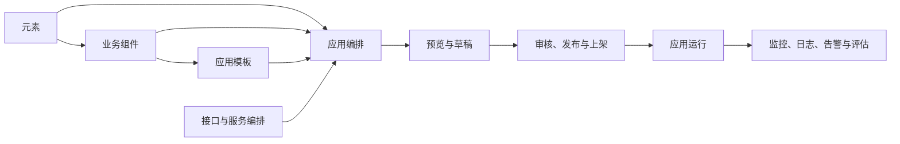

# NGAP 平台与重点优化需求入门指南（NGAP_REQUIREMENTS_ONBOARDING）

> 面向对象：刚加入 NGAP 相关项目的需求人员、产品人员、项目经理及跨项目组协作人员  
> 文档目标：先理解当前 NGAP 平台的作用和能力，再理解本项目组负责的两个重点优化项目  
> 当前工作优先级：**先完成步骤引导式流程改造，再开展自定义元素改造**  
> 更新时间：2026-08-11

---

## 1. 先记住这几句话

1. NGAP 是一个面向应用建设、集成和运营的低代码平台，不只是一个拖拽页面编辑器。
2. 平台把元素、业务组件、模板、接口、事件、流程和运行治理组合成可交付应用。
3. 当前应用建设主要包含“一屏通览页面”和“步骤引导页面”两种形态。
4. 平台已经具备从创建、编辑、预览、保存草稿、提交审核、发布、上架、下架到回滚的生命周期能力。
5. 本项目由多个项目组共同维护，需求不能只考虑某一个编辑页面，还要考虑资产、接口、审核、运行页和兼容性。
6. 本项目组当前最重要的工作是升级“步骤引导式流程”。
7. 引导式改造完成并稳定后，再把旧自定义元素升级成“组件 ZIP 包 + 平台 SDK”的新模式。

---

## 2. NGAP 是什么

NGAP 在项目中的产品定位是“应用集成低代码平台”。它帮助业务和研发团队通过可视化配置，较快地建设生产或运营类应用。

平台当前承载的不是单一页面，而是一整套应用生产链路：



从需求视角理解，NGAP 主要解决五类问题：

- 页面怎么搭：用元素和业务组件搭建页面。
- 数据怎么来：配置接口、数据源、变量和公式。
- 交互怎么做：通过事件动作串联请求、赋值、显隐、跳转、弹窗等行为。
- 流程怎么走：通过节点、分支和业务组件配置步骤式办理流程。
- 应用怎么管：通过审核、发布、上架、下架、回滚、监控和日志治理应用。

因此，需求人员不能把 NGAP 简单理解为“类似画图工具的页面编辑器”。它更接近一个包含资产、设计、流程、集成、发布和运行治理的应用生产平台。

---

## 3. 谁在使用和维护 NGAP

### 3.1 典型使用角色

| 角色 | 主要工作 |
|---|---|
| 应用建设人员 | 选择模板、拖拽元素、配置页面、流程、接口和事件 |
| 业务需求人员 | 定义业务场景、流程、页面信息架构和验收规则 |
| 资产维护人员 | 维护元素、业务组件和模板，推动公共能力复用 |
| 接口/服务人员 | 提供和维护接口能力、入出参、服务编排与环境配置 |
| 审核人员 | 审核应用、业务组件或元素的发布、下线和回滚 |
| 运行运营人员 | 查看应用地图、列表、看板、成效、监控、日志和告警 |
| 平台研发人员 | 维护编辑器、运行时、组件体系、数据模型和公共协议 |
| 安全与架构人员 | 审核动态代码、接口权限、发布产物和平台技术边界 |

### 3.2 多项目组维护意味着什么

NGAP 由多个项目组共同维护，所以一个需求通常会跨越多个责任域：

- 编辑器项目组：负责配置界面和编辑体验。
- 运行时项目组：负责发布后页面的真实运行效果。
- 资产项目组：负责元素、业务组件和模板管理。
- 接口/服务项目组：负责接口目录、服务编排和调用能力。
- 审核与运营项目组：负责状态、审核、上架、下架和运营治理。
- 后端与基础设施项目组：负责数据存储、版本、OSS、构建、扫描和发布。

项目中的实际组织名称可能不同，需求人员应先确认“能力负责人”，不要只根据前端菜单判断归属。

需求评审时必须问：

1. 这个需求改变的是编辑态、预览态、运行态，还是三者都改变？
2. 是否改变保存数据、接口字段或版本规则？
3. 是否影响旧应用、旧元素或已发布版本？
4. 是否需要审核、权限、安全或运维项目组参与？
5. 主项目和独立运行页是否都已经纳入范围？

---

## 4. 当前 NGAP 的核心能力地图

### 4.1 应用建设

平台当前支持生产应用和运营应用建设。

当前创建界面中：

- 生产应用用于建设坐席生产类应用，并集成到生产门户。
- 运营应用用于建设业务运营类应用，并集成到运营门户。
- 生产应用可以选择“一屏通览页面”或“步骤引导页面”。
- 当前运营应用创建流程主要使用一屏通览形态。
- 应用可以从模板创建，也可以不使用模板直接创建。

应用基础信息通常包含：

- 应用名称；
- 应用分类和标签；
- 生产/运营类别；
- 页面展示形式；
- 归属项目或模块；
- 使用范围和属地信息；
- 说明、图标和其他管理信息。

需求人员要区分：

- “应用分类/标签”用于查找、管理和运营统计；
- “页面展示形式”决定运行结构；
- “归属项目/范围”决定协作、权限和资产治理；
- 它们不能混成一个字段使用。

### 4.2 可视化页面编辑

页面编辑器提供低代码搭建能力，当前主要包括：

- 从左侧组件区域拖入元素；
- 通过容器组织页面布局；
- 移动、复制、删除和嵌套元素；
- 配置元素属性；
- 配置视觉样式；
- 配置事件和动作；
- 配置接口和数据；
- 配置页面变量和公式；
- 预览页面；
- 撤销、重做、缩放和全屏编辑；
- 保存草稿；
- 查看和恢复历史保存记录；
- 提交审核。

编辑器对元素通常提供四类设置入口：

| 设置类型 | 需求含义 | 示例 |
|---|---|---|
| 属性 | 元素自身业务参数 | 标题、按钮文字、选项、最大数量 |
| 样式 | 元素外观和布局 | 宽高、颜色、字体、边距、背景 |
| 事件 | 用户操作后的行为 | 点击后请求接口、打开弹窗、赋值 |
| 数据 | 元素的数据来源和映射 | 接口返回、静态数据、变量、字段映射 |

需求设计不能只给页面效果图，还应说明关键元素的属性、数据来源、事件和异常状态。

### 4.3 元素资产

元素是页面搭建的最小可配置单元。

当前平台包含多类内置元素：

| 类别 | 典型能力 |
|---|---|
| 布局类容器 | 分栏、弹性布局、Div、行列、选项卡、表单容器、卡片、折叠面板、循环、底部通栏 |
| 基础类元素 | 文本、图标、标题、头像、按钮、链接、图片、文件、表格、音视频、标签、统计数值 |
| 表单类元素 | 输入、选择、单选、多选、日期、时间、上传、滑块、开关、级联、数字输入、密码框 |
| 高级组件 | AI 会话、列表、描述列表、目录树、步骤条、分页、进度条、时间轴、导航 |
| 图表类 | 折线图、柱状图、折柱组合图、饼图、地图、条形图 |
| 提示与浮层 | 弹窗、抽屉、气泡弹窗、结果页、空状态、加载提示 |
| 自定义元素 | 由平台外部开发并注册到元素库的扩展元素 |

元素通常定义：

- 默认属性；
- 属性面板；
- 可触发事件；
- 可被调用的方法；
- 是否可以包含子元素；
- 是否支持接口、数据源或表单能力。

### 4.4 业务组件资产

业务组件是把多个元素、布局、数据和交互封装成可复用业务单元。

可以把它理解成“已经具备一定业务含义的页面片段”，例如：

- 客户信息区域；
- 查询条件与结果区域；
- 业务办理表单；
- 订单摘要；
- 流程中的某个办理环节。

业务组件与元素的区别：

| 对象 | 粒度 | 典型维护者 | 复用方式 |
|---|---|---|---|
| 元素 | 最小交互/展示单元 | 平台或元素资产人员 | 被页面和业务组件使用 |
| 业务组件 | 业务场景单元 | 业务组件项目组 | 被应用页面或流程节点使用 |
| 应用 | 面向最终用户的完整交付物 | 应用建设团队 | 发布、上架并运行 |

### 4.5 模板资产

模板用于复用成熟的应用结构和页面配置，降低从零开始搭建的成本。

模板可以帮助统一：

- 页面布局；
- 常用元素组合；
- 业务组件选用；
- 基础交互；
- 应用分类下的建设规范。

从模板创建应用后，生成的是新的应用草稿。模板后续变化不能无条件改变已经创建或发布的应用。

### 4.6 服务和接口编排

平台支持配置接口和数据源，把页面从“静态展示”变成“可办理业务的应用”。

典型能力包括：

- 选择已经登记的接口能力；
- 配置接口请求参数；
- 使用页面变量、事件参数或公式生成入参；
- 处理接口返回数据；
- 映射列表、图表或表单字段；
- 在页面加载或用户事件中触发请求；
- 在动作流中串联接口与后续动作。

需求人员需要提供的不是“调一下接口”这句话，而是：

1. 什么时机调用；
2. 入参从哪里取；
3. 成功时页面发生什么变化；
4. 空数据怎么显示；
5. 失败、超时、重复提交怎么处理；
6. 是否需要权限、审计和敏感数据保护。

### 4.7 变量、公式和数据联动

页面变量用于在元素、业务组件和事件之间共享状态。

当前平台可以围绕变量完成：

- 读取页面变量；
- 修改变量；
- 通过公式计算展示值或请求参数；
- 使用事件参数参与计算；
- 根据变量控制显隐、禁用或样式；
- 在不同动作节点之间传递数据。

需求中要明确变量的：

- 名称和业务含义；
- 初始值；
- 数据类型；
- 谁可以修改；
- 生命周期；
- 是否跨流程节点保留；
- 异常或缺失时的默认处理。

### 4.8 事件和动作流

元素事件可以连接一个或多个动作，形成页面交互逻辑。

当前动作能力覆盖：

- 请求接口；
- 变量赋值；
- 组件联动；
- 调用组件方法或表单方法；
- 显示、隐藏、启用和禁用目标元素；
- 打开或关闭弹窗、抽屉和气泡弹窗；
- 页面或应用跳转；
- 消息、通知和确认提示；
- 复制内容；
- 刷新页面；
- 延迟、定时和清除定时；
- 向下一动作发送参数；
- 执行受控脚本；
- 调用客服框架和 CrossAPI 能力。

事件需求至少要包含：

```text
触发条件
→ 前置校验
→ 执行动作
→ 成功反馈
→ 失败反馈
→ 后续状态变化
```

### 4.9 CrossAPI 和宿主系统集成

平台与客服框架、门户、微应用和其他宿主系统存在集成能力。

当前代码中可见的集成场景包括：

- 打开宿主页面或菜单；
- 工单和消息流转；
- 短信相关能力；
- 话务转接；
- 身份和权限认证；
- 同屏、知识详情、辅助办理等协同能力；
- 获取坐席、客户或当前运行上下文。

这些能力通常具有较强的环境和权限依赖。需求评审必须找到对应能力负责人，确认调用条件、失败处理和测试环境，不能只在页面端模拟成功。

### 4.10 应用审核、发布和版本治理

平台已经存在较完整的应用状态和审核链路，包括：

- 草稿；
- 发布提交和发布审核；
- 已发布；
- 上架审核和已上架；
- 下架审核、公示和已下架；
- 回滚审核；
- 停用和废弃；
- 删除。

不同状态允许的操作不同。需求人员设计新能力时，要说明：

- 哪些状态可以编辑；
- 编辑已发布应用是否生成新版本；
- 审核看的是哪一个冻结版本；
- 发布后旧版本是否保留；
- 回滚回到配置版本还是运行产物；
- 上下架是否需要公示和证明材料；
- 谁可以执行操作。

### 4.11 应用运营和运行治理

当前平台菜单中包含：

- 应用地图；
- 应用列表；
- 应用看板；
- 应用成效明细和评估记录；
- 审核管理；
- 应用监控；
- 应用日志；
- 应用告警；
- 限流规则配置。

这说明应用交付不是“发布结束”，还要能观察运行状态、排查错误、控制流量和评估应用效果。

### 4.12 建设态、预览态和运行态

NGAP 实际存在三个容易混淆的使用环境：

| 环境 | 使用者 | 作用 |
|---|---|---|
| 建设态 | 应用建设人员 | 拖拽、配置、保存和修改应用 |
| 预览态 | 建设人员、需求和审核人员 | 在正式发布前验证界面和交互 |
| 运行态 | 最终业务用户 | 使用已经发布、上架的真实应用 |

当前项目的建设/预览主项目和正式独立运行页不是完全相同的代码入口，因此“编辑器预览正常”不能替代“正式运行验证”。

任何影响页面结构、元素注册、接口调用、事件流或流程渲染的需求，都必须同时给出：

- 建设态如何配置；
- 预览态如何检查；
- 运行态如何执行；
- 三者数据如何保持一致；
- 某一环境失败时如何定位和回滚。

---

## 5. 当前两种主要页面形态

### 5.1 一屏通览页面

一屏通览页面以自由页面布局为主。

适合：

- 信息总览；
- 查询和结果展示；
- 看板；
- 单页业务办理；
- 多区域自由组合。

其核心是元素和业务组件在页面中的布局、数据和事件组合。

### 5.2 步骤引导页面

步骤引导页面以业务流程节点为核心。

一个流程通常由多个节点和连线组成，每个节点可能：

- 展示一个业务组件；
- 接收和修改变量；
- 根据条件决定后续路径；
- 等待用户完成当前环节；
- 自动调用接口后继续流转；
- 只参与控制，不展示页面内容。

当前流程能力包含：

- 人工节点；
- 自动节点；
- 条件或变量分支；
- 节点连线和分支选项；
- 节点对应业务组件；
- 当前节点渲染和流程流转；
- 预览、保存和运行。

本项目组的第一个重点优化就是对这一形态进行结构升级。

---

## 6. 一个应用从需求到运行的大致过程

### 阶段 1：需求定义

- 明确生产应用还是运营应用；
- 明确一屏通览还是步骤引导；
- 明确用户、渠道、属地和使用范围；
- 拆分页面、业务组件、流程和接口；
- 定义成功、失败、空数据和权限场景。

### 阶段 2：资产准备

- 确认已有元素是否满足；
- 确认已有业务组件是否可复用；
- 确认是否使用模板；
- 确认接口和 CrossAPI 能力是否已经登记；
- 若缺少资产，明确由哪个项目组新增。

### 阶段 3：应用编排

- 创建应用基础信息；
- 搭建页面或流程；
- 配置属性、样式、事件和数据；
- 绑定接口、变量和动作；
- 预览和自测。

### 阶段 4：草稿和审核

- 保存草稿；
- 检查历史保存；
- 补充审核材料；
- 提交发布审核；
- 按审核意见修改。

### 阶段 5：发布和上架

- 发布形成正式版本；
- 按管理流程申请上架；
- 上架后进入目标门户或运行环境。

### 阶段 6：运行和运营

- 查看监控、日志和告警；
- 评估应用效果；
- 修复问题并发布新版本；
- 必要时下架或回滚。

---

## 7. 核心业务对象速查

| 对象 | 一句话说明 | 需求人员最关心什么 |
|---|---|---|
| 元素 | 页面最小构件 | 能展示什么、能配置什么、有什么事件和方法 |
| 自定义元素 | 平台外部开发的扩展元素 | 如何上传、审核、调用平台能力、兼容运行 |
| 业务组件 | 可复用业务页面片段 | 业务边界、输入输出、复用范围和版本 |
| 模板 | 可复制的应用起点 | 适用场景、初始化内容和后续变更关系 |
| 应用 | 最终发布运行的交付物 | 用户、页面、流程、权限、生命周期和效果 |
| 页面变量 | 页面内共享状态 | 初始值、类型、写入者和生命周期 |
| 接口/数据源 | 页面数据和业务操作来源 | 入参、返回、异常、权限和环境 |
| 事件 | 元素提供的触发点 | 何时发生、携带什么数据 |
| 动作 | 事件触发后的操作 | 执行顺序、成功失败和后续状态 |
| 流程节点 | 步骤引导中的业务环节 | 是否展示、展示什么、如何进入和离开 |
| 分支 | 决定后续流程路径 | 条件来源、优先级、兜底路径 |
| 版本 | 一次冻结的可追踪配置 | 与审核、发布、运行和回滚的关系 |

---

## 8. 本项目组重点优化一：步骤引导式流程改造

> 优先级：P0  
> 顺序要求：必须优先完成并稳定，再启动自定义元素正式改造。

### 8.1 为什么要改

当前步骤引导页面已经具备节点、分支、业务组件和运行能力，但页面展示结构较弱。

当前主要问题可以从需求角度概括为：

1. 流程节点主要按普通步骤理解，难以表达顶部公共信息、普通办理环节和底部全局操作的区别。
2. 导航通常跟随可展示步骤生成，缺少对“是否进入导航”的独立控制。
3. 有些节点只用于自动处理或流程判断，不应该渲染页面，也不应该出现在导航中。
4. 顶部客户信息、步骤导航和底部操作区的滚动、固定关系不够清晰。
5. 需求人员难以直接描述最终页面结构，配置人员也容易依赖节点顺序做隐含约定。
6. 编辑器、预览和独立运行页需要保持完全一致，不能只改编辑器效果。

### 8.2 改造后的目标页面

新的步骤引导页面拆成四个逻辑区域：

```text
顶部核心信息区
智能导航区（整个流程可关闭）
普通环节内容区
底部操作区
```

区域含义：

| 区域 | 主要用途 | 是否进入智能导航 |
|---|---|---:|
| 顶部核心信息区 | 客户摘要、订单概要、全流程公共信息 | 否 |
| 智能导航区 | 展示可导航的普通办理环节 | 本身就是导航 |
| 普通环节内容区 | 展示实际办理步骤和业务组件 | 每个节点单独决定 |
| 底部操作区 | 上一步、下一步、提交、取消等全局操作 | 否 |

### 8.3 节点展示模型

每个流程节点增加“展示区域”配置：

```ts
interface ProcessNodePresentation {
    region: 'header' | 'content' | 'footer' | 'control';
    showInNavigator: boolean;
    navigatorTitle?: string;
}
```

需求语言中的含义：

| region | 含义 | 页面表现 |
|---|---|---|
| `header` | 顶部公共信息节点 | 渲染在顶部，不进入导航，最多一个 |
| `content` | 普通业务办理节点 | 渲染在内容区，可选择是否进入导航 |
| `footer` | 全局底部操作节点 | 渲染在底部，不进入导航，最多一个 |
| `control` | 纯流程控制节点 | 参与判断和流转，但不渲染，不进入导航 |

重要原则：展示配置属于“这个流程中的节点实例”，不属于业务组件模板。

原因是同一个业务组件在不同流程中可能承担不同作用，不能因为某次被放在顶部，就永久变成顶部组件。

### 8.4 流程级页面配置

整个流程增加页面级配置：

```ts
interface GuidedProcessConfig {
    navigator: {
        enabled: boolean;
        title: string;
    };
    scrollMode: 'fixed-top' | 'full-page';
}
```

需求含义：

- `navigator.enabled`：整个流程是否显示智能导航。
- `navigator.title`：智能导航区域标题。
- `fixed-top`：顶部核心信息和导航保持固定，内容区独立滚动。
- `full-page`：顶部、导航、内容和底部按整页一起滚动。

### 8.5 必须遵守的业务规则

1. 一个流程最多一个 header 节点。
2. 一个流程最多一个 footer 节点。
3. header、footer 和 control 节点不能进入智能导航。
4. content 节点可以单独决定是否进入导航。
5. control 节点可以没有业务组件。
6. 导航关闭后，流程仍必须可以正常办理和流转。
7. 导航标题优先使用节点配置的 `navigatorTitle`，缺失时回退到节点名称或组件名称。
8. 不允许继续依靠“第一个节点默认是顶部、最后一个节点默认是底部”这类隐含规则。
9. 流程逻辑顺序和页面展示区域是两个维度，不能互相替代。
10. 新字段缺失的旧流程必须继续按旧方式正常运行。

### 8.6 改造包含哪些需求范围

#### 流程编辑器

- 节点菜单增加“展示设置”；
- 可选择 header/content/footer/control；
- content 节点可设置是否进入导航；
- 可配置导航标题；
- 重复 header/footer 时即时校验；
- control 节点不强制选择页面组件；
- 画布上能识别不同展示角色。

#### 页面级配置

- 增加导航总开关；
- 增加导航标题；
- 增加页面滚动模式；
- 配置保存到流程级数据，而不是某个元素里。

#### 预览

- 使用真实四区页面结构；
- 节点显隐、导航和滚动行为与运行页一致；
- 支持人工、自动和分支节点预览；
- 能验证没有页面组件的 control 节点。

#### 正式运行

- 主运行时和独立 `page` 运行时一致；
- 按节点实例渲染，不能只按扁平元素数组推导导航；
- 导航定位使用稳定 nodeId；
- 节点切换后正确滚动和更新状态；
- 单个节点组件异常不应让整条流程白屏。

#### 保存与兼容

- 新增节点展示字段；
- 新增流程页面配置；
- 验证后端接口是否原样保存和返回；
- 旧流程缺失新字段时使用兼容默认值；
- 不改变人工节点、自动节点、变量分支等既有核心流程能力。

### 8.7 这次不做什么

- 不重写整个流程引擎；
- 不改变人工、自动、条件分支的基本业务含义；
- 不把展示配置放进业务组件模板；
- 不强制所有普通环节都进入导航；
- 不要求旧流程一次性迁移；
- 不只做静态页面样式而忽略保存和运行时；
- 不在本阶段同时启动自定义元素正式改造。

### 8.8 需求验收重点

#### 功能验收

- 可以配置并正确渲染一个顶部节点；
- 可以配置并正确渲染一个底部节点；
- 多个 content 节点可分别控制是否进入导航；
- control 节点不渲染但仍参与流程；
- 导航可以全局关闭；
- 两种滚动模式表现正确；
- 导航点击、当前步骤变化和内容定位正确；
- 重复 header/footer 能被阻止；
- 节点没有业务组件时规则正确；
- 分支切换后导航和内容同步更新。

#### 兼容验收

- 旧步骤引导应用可以打开、预览和运行；
- 一屏通览应用不受影响；
- 普通业务组件不因新展示配置改变；
- 底部通栏等旧元素在非引导页面中不回归；
- 主编辑器预览和独立运行页一致。

#### 数据验收

- 保存后重新打开配置不丢失；
- 草稿、审核预览和发布版本使用同一配置；
- 历史保存和版本恢复包含新增字段；
- 复制应用或模板时字段规则明确；
- 新旧接口响应均能正确兼容。

### 8.9 需求人员在此阶段的主要产出

1. 四区页面示意和典型场景；
2. 节点展示设置字段和文案；
3. 页面级配置字段和默认值；
4. header/footer/control 的约束和错误提示；
5. 导航生成、排序、标题和点击规则；
6. 两种滚动模式的交互说明；
7. 旧数据兼容规则；
8. 人工、自动、分支和无页面节点的验收用例；
9. 编辑、预览、审核预览和运行页一致性用例；
10. 涉及项目组、接口和负责人清单。

### 8.10 引导式改造完成门槛

只有同时满足下面条件，才算“引导式改造完成”，才能把主力转向自定义元素：

- 产品规则冻结并评审通过；
- 编辑器配置完整；
- 保存和查询接口闭环；
- 预览四区结构通过；
- 独立运行页通过；
- 旧流程兼容回归通过；
- 一屏通览回归通过；
- 人工、自动、条件分支和 control 节点通过；
- 审核、发布、版本和历史保存通过；
- 关键问题有监控和回滚方案。

### 8.11 环节类型和数据归属：需求人员必须重点确认

这次引导式改造还有一个比页面布局更基础的问题：多个环节进入同一个运行页面以后，各环节的数据到底放在哪里。

#### 为什么当前方式会让人不停想变量名

当前运行时会把不同环节的变量、表单值和接口结果合并到一个页面级数据容器中。假设两个环节都定义：

```text
result
list
selectedValue
```

平台就很难判断这些数据分别属于哪个环节。配置人员只能把名称改成：

```text
customerSelectResult
orderQueryResult
creditCheckResult
```

流程越长，名称越难维护。节点复制、组件复用和多人协作时仍可能重名。这不是一个应由需求人员或配置人员承担的问题，平台必须在数据结构上隔离。

#### 三种执行类型

需求上应把业务环节分成三类：

| 类型 | 用户是否操作 | 是否展示界面 | 典型场景 |
| --- | --- | --- | --- |
| 人工环节 | 是 | 是 | 选择客户、填写信息、确认提交 |
| 自动环节 | 否 | 可以展示 | 自动查订单并展示、自动计算额度 |
| 服务环节 | 否 | 默认不展示 | 调服务、转换数据、判断条件、选择分支 |

“自动环节”可以查数据后展示结果，不等于无页面；“服务环节”才是默认不渲染、只参与流程执行和分支判断的节点。

#### 执行类型和页面区域不是一回事

页面区域仍是：

```text
header  顶部
content 正文
footer  底部
control 控制区，不渲染
```

人工、自动、服务回答“怎么执行”；四个区域回答“在哪里展示”。

通常服务环节默认放在 `control`，但产品和数据模型中仍要保留两个独立字段，不能把“服务”和“control”当成同一个概念。

#### 目标数据归属

每个流程节点实例都有自己的数据盒子：

```text
客户选择环节
  输入
  本地变量
  表单数据
  接口结果
  输出

订单查询环节
  输入
  本地变量
  表单数据
  接口结果
  输出

流程共享
  明确声明为全流程共用的数据
```

这样两个环节都可以有一个叫 `result` 的本地变量，平台通过节点 ID 自动隔离，用户不需要起全局唯一名称。

#### 哪些数据可以跨环节

默认情况下，其他环节不能直接读取某节点的本地变量、表单或完整接口结果。节点需要把允许使用的数据声明为“输出”。

例如：

```text
客户选择环节
  输出：selectedCustomerId

订单查询环节
  输入：customerId
  绑定来源：客户选择环节 / selectedCustomerId
```

界面上应使用选择器完成绑定：

```text
选择数据来源
  → 上游环节
  → 客户选择
  → 输出
  → 已选客户 ID
```

底层保存稳定的节点 ID 和输出 key。即使节点显示名称后来改变，绑定也不能失效。

#### 用户还需要起什么名字

用户只需要维护：

- 节点显示名称，例如“客户选择”；
- 当前节点内部容易理解的本地字段名；
- 对外输出的业务名称，例如“已选客户 ID”。

平台负责：

- 不可变节点技术 ID；
- 节点数据隔离；
- 引用关系；
- 重名检测；
- 节点重命名后的引用保持；
- 数据来源追踪。

只有一个节点被其他节点引用时，平台才需要自动生成可读别名。别名不是主键，也不应要求每个用户手工填写。

#### 人工、自动、服务的数据过程

人工环节：

```text
读取输入
→ 展示表单或选择界面
→ 用户操作
→ 生成输出
→ 判断分支
```

自动环节：

```text
读取输入
→ 自动查询或计算
→ 保存本环节接口结果
→ 可选展示结果
→ 生成输出
→ 自动或确认后推进
```

服务环节：

```text
读取输入
→ 调服务、转换或判断
→ 保存必要输出和分支结果
→ 不渲染页面
→ 进入下一节点
```

#### 分支切换时的数据规则

如果用户修改前面环节的选择，流程从分支 A 切换到分支 B：

- 分叉点之前的数据保留；
- 分支 A 中已退出环节的数据整体清除；
- 分支 A 未完成的接口请求应取消或忽略旧结果；
- 分支 B 从第一个新环节重新执行；
- 不允许分支 A 的同名变量污染分支 B。

#### 需求人员需要确认的产品决策

1. 人工、自动、服务三类名称和帮助文案；
2. 自动环节查询完成后是自动推进还是等待确认；
3. 服务环节是否进入导航，默认建议不进入；
4. 节点输出的名称、类型、必填和敏感字段标记；
5. 哪些数据允许发布为流程共享；
6. 节点删除或输出变更时如何展示引用影响；
7. 分支回滚时人工表单是否保留；
8. 失败、重试、超时和取消的交互；
9. 运行诊断中服务节点展示哪些信息；
10. 旧全局变量和旧公式的迁移提示。

#### 此部分验收重点

- 两个环节使用同名本地变量，数据互不覆盖；
- 同一业务组件在一个流程中使用两次，两个实例数据独立；
- 下游只能选择上游公开输出，不能看到上游内部变量；
- 节点重命名后已有绑定仍然有效；
- 人工、自动、服务三类环节按定义执行；
- 服务环节不渲染，但运行日志可查看状态和分支结果；
- 切换分支后旧路径数据被正确释放；
- 主编辑器预览和独立运行页的数据行为一致；
- 旧流程仍可运行，并能识别和提示同名全局变量风险。

### 8.12 环节正式输出：多字段、多选和组件内部状态怎么决定分支

当前人工分支已经能读取业务组件内部部分 `Select/Radio` 的值，也能在一个分支中配置多个条件。因此，简单的多字段组合在现有机制中可以实现。

但它目前更接近：

```text
监听组件内部原子值
→ 任一值变化
→ 立即重新判断分支
```

它还不是正式的“环节输出”。当一个环节内部有多选、多个表单、多个子组件，必须全部输入或选择完成后才能决定路线时，现有方式存在几个需求风险：

- 流程配置直接依赖组件内部原子 ID；
- 用户尚未填写完整就可能开始判断；
- 修改一个选项时，后续环节可能反复删除和重新加载；
- 完整 React 组件自己的内部 state，平台无法天然读取；
- 下游环节拿到的是零散字段，不是稳定的业务结果；
- 组件内部结构调整后，旧分支配置容易失效。

目标模型应当是：

```text
环节内部多个组件产生草稿
→ 检查必填项和业务校验
→ 用户确认完成
→ 环节形成一份正式输出
→ 引导式引擎根据正式输出判断连线
```

例如“材料和办理方式选择”环节可以正式输出：

```json
{
  "selectedMaterials": ["ID_CARD", "LICENSE"],
  "deliveryMode": "MAIL",
  "applicantType": "COMPANY"
}
```

流程分支读取的是：

```text
当前环节 / 输出 / 已选择材料
当前环节 / 输出 / 领取方式
当前环节 / 输出 / 申请人类型
```

而不是直接读取：

```text
Select_123
Radio_456
Select_789
```

人工环节默认应区分三个阶段：

```text
draft：用户还在填写，可以反复修改
ready：所有必填和校验已经通过，可以提交
completed：用户已经确认，正式输出已经产生
```

流程默认只在 `completed` 后推进。“选择后自动进入下一步”可以作为少数场景的显式配置，但不能作为所有人工环节的默认行为。

多选分支至少需要支持以下业务表达：

- 包含任意选项；
- 同时包含全部指定选项；
- 选择集合完全相同，忽略先后顺序；
- 不包含某选项；
- 选择数量等于、大于或小于指定数量；
- 为空或非空；
- 多个输出字段之间使用“全部满足”或“任一满足”。

组件只负责输出业务结果，不能直接决定下一节点。例如组件可以输出：

```text
decisionCode = NEED_REVIEW
```

画布再配置：

```text
decisionCode = NEED_REVIEW → 人工复核环节
```

不能让组件直接输出 `nextNodeId`，否则流程关系会隐藏到组件代码中，画布连线将不再可信。

现有低代码业务组件和未来 React ZIP 组件应共用同一种环节输出概念：

```text
现有低代码组件：内部原子值通过“输出映射”形成 output
完整 React 组件：通过平台 SDK 提交 draft、校验结果和 output
```

对流程引擎而言，两类组件最终都只产生标准 `node.output`。

此部分验收至少包括：

- 一个环节包含多个内部字段时，可以等全部填写完成再推进；
- 多选的不同组合可以稳定命中不同分支；
- 分支不读取未确认草稿；
- 节点输出拥有名称、中文标题、类型、必填和敏感标记；
- 下游只看到上游公开输出，看不到内部 state；
- 用户返回修改后，原输出和原分支后续数据同时失效；
- 现有低代码组件与未来 React ZIP 组件可以使用同一套输出和分支模型。

### 8.13 线性运行范围和待完善事项

本轮已经明确：设计图可以有分支和重新汇合，但一次流程运行始终只有一条活动路径。

```text
       ┌→ B ─┐
A ─选择┤      ├→ D
       └→ C ─┘
```

一次只运行 `A-B-D` 或 `A-C-D`。D 不等待另一条未被选择的路线。本轮不设计 B、C 同时执行后再汇聚的并行流程。

尚未冻结的事项已经单独记录在：

[引导式流程待完善事项（GUIDED_PROCESS_PENDING_ITEMS）](<./GUIDED_PROCESS_PENDING_ITEMS(引导式待完善事项).md>)

其中 P0 事项包括：

- 人工环节默认何时算正式完成；
- 正式状态机和失败状态；
- 输出 Schema、完整 React 组件输出协议；
- 多选集合条件和分支唯一命中规则；
- 完整流程图保存校验；
- 分支回滚、返回修改和副作用处理；
- 页面刷新、重新办理和断点恢复；
- 自动/服务节点超时、重试、取消和幂等；
- 主预览与独立运行页如何共享同一引擎；
- header/footer 节点的执行生命周期。

需求人员后续应先逐项确认 P0，再决定哪些进入第一期，哪些明确不支持，避免开发过程中不断改变运行时基础模型。

---

## 9. 本项目组重点优化二：自定义元素改造

> 优先级：P1  
> 启动条件：引导式流程改造完成并进入稳定状态。

### 9.1 当前自定义元素是什么

当前自定义元素通过三份平台定制文件接入：

```text
TSX 组件源码
Schema TS 配置文件
Less 样式文件
```

平台下载这些源码，在浏览器中编译，然后注册到元素菜单和运行时。

当前模式已经能够运行，但存在明显问题：

- 开发者必须理解平台专用 Schema；
- 一个组件被拆成三次上传和保存；
- 主项目、预览和独立运行页存在重复编译逻辑；
- 浏览器动态编译和全局变量方式难以治理；
- 多模块、资源和正常 React 工程结构支持不足；
- 组件如何调用项目 API 缺少稳定公共协议；
- 版本、权限、扫描、签名和运行锁定能力不足。

当前仓库中已有一个“单 TSX 函数组件上传”模拟入口，但它只用于验证原页面链路，不是正式目标方案。

### 9.2 目标方案

正式目标是上传一个受约束的 React 组件 ZIP 包：

```text
customer-info-card.zip
├─ ngap.json
├─ package.json（可选，仅用于开发元数据）
├─ README.md（可选）
├─ src/
│  ├─ index.tsx
│  ├─ types.ts
│  ├─ hooks/
│  └─ styles/index.less
└─ assets/
```

其中：

- `src/index.tsx` 默认导出 React 组件；
- `ngap.json` 声明入口、属性、事件、方法、依赖、SDK 版本和权限；
- ZIP 内可以拆分 TSX/TS、样式和静态资源；
- ZIP 不是任意 npm 工程，不允许携带 `node_modules` 或执行安装脚本；
- 平台服务端负责分析、扫描和构建；
- 生产运行页只加载不可变的构建产物，不在线解压和编译 ZIP。

### 9.3 组件作者的目标流程

```text
下载官方模板
→ 按普通 React 方式开发组件
→ 在 ngap.json 声明平台元数据和权限
→ 本地校验和预览
→ 打包一个 ZIP
→ 平台上传并分析
→ 查看属性、事件、方法、依赖和权限诊断
→ 使用真实宿主能力预览
→ 保存草稿
→ 提交审核
→ 服务端构建、扫描和签名
→ 发布为不可变版本
```

### 9.4 为什么项目 API 必须由平台暴露

自定义组件会需要使用：

- 页面变量；
- 已配置接口；
- 平台登记接口；
- 事件流；
- 消息和确认框；
- 文件上传下载；
- 页面跳转；
- 用户基础信息；
- CrossAPI 或宿主集成；
- 组件实例存储；
- 日志。

这些能力必须由项目通过版本化 SDK `context` 提供。

组件不能直接依赖：

```text
项目 Store
内部 request/axios 实例
Token、Cookie 和环境地址
原始 CrossAPI 对象
项目内部页面或工具文件
```

原因：

1. 内部实现不是稳定产品协议；
2. 直接暴露会导致组件越权；
3. 平台无法审计组件调用了什么；
4. 项目以后无法安全重构 Store 和请求层；
5. 主编辑器和独立运行页难以保持一致。

目标 SDK 大致分为：

| SDK 能力 | 用途 |
|---|---|
| `context.variables` | 读写变量、订阅变化、计算公式 |
| `context.api` | 调用实例已配置接口或平台登记接口 |
| `context.events` | 触发平台事件流 |
| `context.ui` | 消息、通知和确认框 |
| `context.files` | 受控上传和下载 |
| `context.navigation` | 页面、应用、微应用或外链跳转 |
| `context.integrations` | 调用经过治理的 CrossAPI/宿主能力 |
| `context.storage` | 当前组件实例的隔离存储 |
| `context.logger` | 带元素和版本信息的日志 |

每个 ZIP 都要声明最小权限，例如：

```json
{
  "sdk": {
    "version": "^2.0.0",
    "permissions": [
      "variables.read",
      "events.emit",
      "api.call:customer.query",
      "ui.message"
    ]
  }
}
```

新增高风险权限需要重新审核，不能通过组件升级静默扩权。

### 9.5 自定义元素改造的需求范围

#### 元素管理

- 从三文件上传改为 ZIP 包上传；
- 展示 ZIP 文件树、入口、样式、资源和依赖；
- 展示自动推导的属性、事件和方法；
- 支持人工修正元数据；
- 展示 SDK 权限及风险等级；
- 展示构建和扫描诊断；
- 支持保存草稿、审核、发布和版本管理。

#### 开发协议

- 标准 ZIP 目录；
- `ngap.json` 字段和校验规则；
- Props、事件和 ref 方法规则；
- 宿主依赖白名单；
- SDK 能力、权限和版本；
- 官方模板、类型包、本地 mock 和校验工具。

#### 构建与安全

- ZIP 路径、大小、文件数和压缩炸弹检查；
- 外部依赖白名单；
- 危险代码扫描；
- 服务端异步构建；
- JS/CSS/资源 hash；
- runtime manifest；
- 签名和不可变产物；
- 审核与发布使用同一冻结产物。

#### 编辑器和运行时

- 属性面板自动生成；
- 事件进入现有动作流；
- 方法可被平台动作调用；
- 主编辑器和独立运行页共用协议；
- v1 和 v2 元素可以混合运行；
- 页面实例逐步锁定元素版本和 artifactHash。

### 9.6 这次不做什么

- 不接受包含 node_modules 的任意 npm 工程；
- 不允许任意外部依赖；
- 不把项目 Store 和 request 变成公共 API；
- 不用浏览器 Babel 作为正式生产构建器；
- 不强制立即迁移全部旧元素；
- 不承诺 AST 自动推导所有复杂配置；
- 不把 SDK 权限误认为浏览器安全沙箱；
- 不在引导式改造未稳定时同时大规模修改共享运行链路。

### 9.7 自定义元素验收重点

- 一个标准 ZIP 可以上传、分析、预览和保存；
- 多模块、Less/CSS 和静态资源正常；
- `ngap.json` 能声明完整平台元数据；
- 属性面板自动生成且允许修正；
- 事件和方法进入现有平台能力；
- 未声明权限调用被拒绝；
- 项目 API 只通过 SDK 暴露；
- 服务端构建和扫描可追踪；
- 运行页不下载、解压或实时编译原 ZIP；
- 主编辑器和独立运行页一致；
- v1/v2 同页正常；
- 发布新元素版本不会静默改变旧应用；
- 单个元素失败不会造成整页白屏。

---

## 10. 两个优化项目为什么必须按顺序做

### 10.1 正式顺序


### 10.2 先做引导式的原因

1. 引导式是当前最重要的业务体验优化，直接影响步骤办理场景。
2. 引导式改造会触及页面渲染结构、导航、节点数据、预览和独立运行页。
3. 自定义元素改造也会触及 `NgapRender`、元素注册和独立运行页。
4. 两项同时大规模修改，共享运行链路容易发生冲突，问题归属难判断。
5. 先稳定节点级四区渲染，可以为以后自定义元素在引导页面中的运行提供清晰宿主结构。
6. 需求、测试和跨项目组资源可以分阶段聚焦，降低协作成本。

### 10.3 什么时候可以启动自定义元素正式开发

以下条件全部满足后再启动：

- 引导式产品规则不再频繁变化；
- 新旧流程数据兼容已经验证；
- 主编辑器预览通过；
- 独立运行页通过；
- 发布版本回归通过；
- 一屏通览和普通业务组件没有回归；
- 引导式关键缺陷进入可控范围；
- 共享渲染层的最终接口已经稳定；
- 各项目组对自定义元素 ZIP、SDK 和服务端构建责任有明确分工。

前期可以做自定义元素的协议评审、接口调研和样例准备，但不要在引导式运行链路尚未稳定时合入大规模运行时代码。

---

## 11. 跨项目组协作清单

### 11.1 引导式改造需要的协作角色

| 协作域 | 需要确认的内容 |
|---|---|
| 产品/需求 | 四区含义、节点规则、导航、滚动和默认值 |
| 流程编辑器 | 节点设置、校验、画布标识和保存状态 |
| 页面运行时 | 节点级渲染、导航定位、滚动和异常隔离 |
| 业务组件 | header/content/footer 场景下的尺寸和交互适配 |
| 后端接口 | 新字段透传、历史、复制、审核和版本保存 |
| 测试 | 新旧流程、分支、双运行时和一屏通览回归 |
| 发布运维 | 灰度、监控、回滚和兼容策略 |

### 11.2 自定义元素改造需要的协作角色

| 协作域 | 需要确认的内容 |
|---|---|
| 元素管理 | ZIP 上传向导、元数据编辑和版本生命周期 |
| 组件协议 | `ngap.json`、Props、事件、方法和模板 |
| SDK/平台能力 | 变量、接口、事件、文件、导航、CrossAPI 能力目录 |
| 构建服务 | 解包、扫描、构建、产物、hash、签名和任务状态 |
| 编辑器运行时 | registry、Props adapter、预览和属性面板 |
| 独立运行页 | runtime manifest、版本加载和 SDK host adapter |
| 安全架构 | 可信角色、权限、代码扫描和未来 iframe 隔离 |
| 审核发布 | 权限 diff、冻结 artifact 和不可变版本 |
| 测试 | ZIP、依赖、权限、安全、v1/v2 和双运行时矩阵 |

### 11.3 推荐的责任表达方式

每一项跨组需求都要有：

```text
能力负责人
接口负责人
前端负责人
运行时负责人
测试负责人
审核/安全负责人
计划版本
前置依赖
验收证据
```

不要只记录“某某组配合”，应明确对方交付什么、什么时候交付、如何判断完成。

---

## 12. 新进需求人员的建议学习顺序

### 第 1 步：先理解平台业务闭环

重点搞清楚：

- 元素、业务组件、模板、应用的关系；
- 一屏通览和步骤引导的区别；
- 接口、变量、事件和动作如何让页面运行；
- 草稿、审核、发布、上架和回滚的关系。

### 第 2 步：实际走一遍应用建设

建议在可用环境完成：

1. 新建一个一屏通览应用；
2. 拖入文本、按钮、表单和容器；
3. 修改属性和样式；
4. 配置一个按钮事件；
5. 配置一个变量和接口；
6. 预览；
7. 保存草稿；
8. 查看历史保存；
9. 了解提交审核入口。

### 第 3 步：走一遍步骤引导应用

重点观察：

- 节点和业务组件的关系；
- 人工节点、自动节点和条件分支；
- 当前导航和页面渲染方式；
- 现状为什么难以表达 header/footer/control；
- 编辑预览和正式运行的差异风险。

### 第 4 步：精读引导式改造方案

重点看：

- 数据模型；
- 四区页面；
- 节点设置；
- 导航和滚动；
- 保存兼容；
- 主项目与独立运行页；
- 测试和实施阶段。

### 第 5 步：引导式稳定后再学习自定义元素

重点搞清楚：

- 当前三文件元素为什么难维护；
- ZIP 不是任意 npm 工程；
- `ngap.json` 负责什么；
- SDK 为什么必须由项目暴露；
- 为什么正式运行依赖服务端构建和不可变产物；
- v1/v2 为什么要长期兼容。

---

## 13. 需求文档写作检查表

### 业务背景

- 谁遇到问题？
- 当前怎么操作？
- 问题发生在建设、审核还是运行阶段？
- 影响范围和频率是多少？

### 产品规则

- 对象是什么？
- 字段和默认值是什么？
- 有哪些唯一性、数量和状态约束？
- 空值、异常和边界情况怎么处理？

### 编辑与运行

- 编辑器如何配置？
- 预览如何验证？
- 正式运行如何表现？
- 两套运行时是否一致？

### 数据与接口

- 保存在哪里？
- 查询和保存接口是否透传？
- 旧数据默认值是什么？
- 复制、模板、历史和版本怎么处理？

### 生命周期

- 哪些状态允许编辑？
- 是否需要审核？
- 审核对象是否冻结？
- 发布、上架、下架、回滚怎么处理？

### 兼容和安全

- 旧应用是否受影响？
- 是否有权限变化？
- 是否执行动态代码或调用敏感接口？
- 是否有灰度和回滚方案？

### 验收

- 主流程用例；
- 异常用例；
- 权限用例；
- 状态用例；
- 旧数据兼容用例；
- 主编辑器和独立运行页一致性用例。

---

## 14. 常见误区

### 误区 1：只画页面效果图

NGAP 页面还包含数据、事件、接口、变量、流程和生命周期。效果图只能表达一部分需求。

### 误区 2：编辑器能用就算完成

发布后的独立运行页才是最终用户使用的环境。编辑、预览和运行必须一致。

### 误区 3：节点顺序可以代表页面区域

流程顺序和页面区域是不同概念。新的引导式方案必须显式配置 header/content/footer/control。

### 误区 4：业务组件自己决定放在哪个区域

展示区域属于当前流程节点实例，同一个业务组件可以在不同流程承担不同角色。

### 误区 5：自定义元素就是上传一个 TSX

正式方案是受约束 ZIP、`ngap.json`、平台 SDK、服务端构建和版本产物的完整闭环。

### 误区 6：把 request 或 Store 暴露给自定义组件最省事

这会把项目内部实现变成长期公共协议，带来越权、不可审计和无法重构的问题。必须通过 SDK 暴露能力。

### 误区 7：两个优化点可以一起大改

两者都会影响共享渲染链路和独立运行页。当前明确先完成引导式，再改自定义元素。

---

## 15. 相关文档

### 项目上下文和现状记忆（CODEX_CONTEXT.md）

[CODEX_CONTEXT.md](./CODEX_CONTEXT.md)

用于了解项目位置、已完成工作、真实接口样例、关键源码和当前验证状态。

### 引导式流程展示编排升级详细设计（GUIDED_PROCESS_REDESIGN）

[GUIDED_PROCESS_REDESIGN(引导式流程展示编排升级设计).md](<./GUIDED_PROCESS_REDESIGN(引导式流程展示编排升级设计).md>)

这是当前第一优先级项目的详细研发方案，包含数据模型、编辑器、运行时、兼容、文件改造和测试计划。

### 引导式流程待完善事项（GUIDED_PROCESS_PENDING_ITEMS）

[GUIDED_PROCESS_PENDING_ITEMS(引导式待完善事项).md](<./GUIDED_PROCESS_PENDING_ITEMS(引导式待完善事项).md>)

用于逐项确认环节完成、输出、分支、回滚、刷新恢复、失败策略、双运行时和版本治理等尚未冻结的问题。

### 自定义元素完整设计·理想方案（CUSTOM_ELEMENT_REDESIGN）

[CUSTOM_ELEMENT_REDESIGN(完整设计-理想方案).md](<./CUSTOM_ELEMENT_REDESIGN(完整设计-理想方案).md>)

这是第二优先级项目的详细研发方案，包含 ZIP、`ngap.json`、SDK、服务端构建、registry、双运行时、安全和迁移。

### NGAP 核心改造记录（REFACTOR_NOTES）

[REFACTOR_NOTES(NGAP核心改造记录).md](<./REFACTOR_NOTES(NGAP核心改造记录).md>)

用于记录已经取得的接口样例、当前数据缺口和改造状态。

---

## 16. 当前路线结论

本项目组接下来的主线不是同时推进两个大型改造，而是严格分阶段：

```text
先把步骤引导式流程改造成稳定的四区页面和节点展示模型
→ 打通编辑、保存、预览、审核、发布和独立运行页
→ 完成旧数据及一屏通览回归
→ 进入稳定观察
→ 再冻结自定义元素 ZIP 和 SDK 协议
→ 再实施 ZIP 上传、服务端构建和双运行时接入
```

对新进需求人员而言，当前最重要的学习和产出顺序也是：

1. 理解 NGAP 当前完整能力；
2. 深入掌握步骤引导式流程现状与目标；
3. 推动引导式规则、接口和验收闭环；
4. 引导式稳定后，再进入自定义元素改造。
